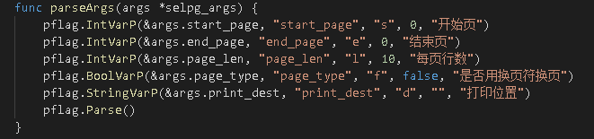

# Golang 开发CLI程序selpg  
## 项目需求
- 请按文档 使用 selpg 章节要求测试你的程序
- 请使用 pflag 替代 goflag 以满足 Unix 命令行规范， 参考：Golang之使用Flag和Pflag
- golang 文件读写、读环境变量，请自己查 os 包
- “-dXXX” 实现，请自己查 os/exec 库，例如案例 Command，管理子进程的标准输入和输出通常使用 io.Pipe，具体案例见 Pipe
  
## selpg介绍  
Linux命令行使用程序 - selpg，全称select page，selpg允许用户从源（标准输入流或文件）读取指定页数的内容到目的地（标准输出流或给给打印机打印）  
  
## selpg设计的主要过程
- 读取命令行参数
- 待处理文件的读写
- 终端的输入输出
### 命令行参数的解析
**selpg -s start_page number -e end_page number [options][-l line number | -f][-d destination] filename**  
  
必须参数：  
- -s：后面接一个不小于1的整数，表示开始的页号，
- -e：后面接一个不小于开始页号的整数，表示结束的页号  
  
可选参数：
- -l：后面接一个整数，表示每页的行数，若无此参数（且无-f）则默认为72行
- -f：后面不接任何值，表示按分页符'\f'分页
- -d：后面接打印机号，当无打印机时，后面接一字符串，通过grep命令处理后显示
- filename：表示读取的文件名  
### 1、包的引入
- bufio包
    > 实现了有缓冲的I/O。它包装一个io.Reader或io.Writer接口对象，创建并是实现另一接口，且同时还提供了缓冲和一些文本I/O的帮助函数的对象。  
      
- os/exec包
    > os/exec包执行外部命令。它包装了os.StartProcess函数以便更容易的修正输入和输出，使用管道连接I/O，以及作其它的一些调整。可以帮助我们在程序中启动子进程并使用管道连接I/0。过程：建立子进程输入管道 -> 启动子进程 -> 从父进程接收标准输出 -> 关闭管道 -> 关闭子进程。
  
- pflag包  
    > 对命令行参数进行解析。比golang自带的flag包有更强的兼容性以及更强大的功能。通过在本地的go工作环境中的src目录下**go get github.com/spf13/pflag**添加。

      

### 2、命令行结构体构建
**其中，page_type为true时，命令行参数为"-f"，为false时为"-l line number"**  
  
  

### 3、命令行参数解析
**parseArgs函数用pflag包对命令行参数进行解析，通过pflag包中的IntVarP、BoolVarP、StringVarP函数将参数中的标志初始化为相应的变量类型，最后通过Parse()函数将参数解析出来**  
  

      

### 4、命令行参数检查  
- 检查参数的长度（不能小于3）  
  
      
  
- 检查第一个必须参数-s以及后面接的start_page是否合法（不能小于1）  
  
      
  
- 检查第二个必须参数-e以及后面的end_page（不小于start_page）：**因为用的pflag包，而在这个包中已经默认将-e参数解析为了Int，因此不需要再对-e进行判定。只需判断end_page的大小是否合法就行了**  
  
      
  
- 检查输入文件的行数是否合法(不能小于1)  
  
      
  
- 最后检查输入文件的存在性和可读性  
  
      
  
### 5、对输入文件进行处理  
**根据命令行参数对输入文件做出相应的处理**  
  
- 输入文件的合法性判断以及打印位置的设置，用os/exec包中的Command函数实现模拟打印机.其中StdinPipe函数返回一个连接到command标准输入的管道pipe。我们可以通过在此处写入传输信息，然后作为子进程的标准输入。
  
      
  
- 然后创建一个bufio对象newReader，该对象有一个缓冲区，与os.Stdlin得到的数据流进行绑定。然后就可以通过ReadBytes('\n')1按行读取缓冲区中数据  
  
      
  
- 最后当分页后的页行数都小于规定行数时，结束selpg，并将分页结果录入out文件  
  
      
      

### 6、main函数  
**按步骤执行selpg**  
  
      
  
## 程序测试  
**说明：in.txt为输入文件，out.txt为模拟打印机输出文件（初始为空），error.txt为报错信息（初始为空）。上面文件都放在与selpg.go同一目录下的TestFile文件夹中.初始的分页行数为10行。**  
  
in.txt内容如下：
  
  
  

- selpg -s1 -e1 TestFile/in.txt  
  
      
  
- selpg -s1 -e2 TestFile/in.txt
  
      
      
- selpg -s1 -e1 <TestFile/in.txt selpg -s2 -e2 <TestFile/in.txt(显示第一/二页的内容)  
  
      
      
- selpg -s1 -e1 TestFile/in.txt > TestFile/out.txt(将分页的第一页内容写入out.txt中) 
  
      
      
- selpg -s1 -e1 TestFile/in.txt | other_command(正常执行其他指令:ls、wc、cat)  
  
      
      
- selpg -s1 -e10 TestFile/in.txt 2> TestFile/error.txt（将错误指令格式的报错信息写入error.txt中）  
  
      
      
- selpg -s1 -e1 -l4 TestFile/in.txt 以及 selpg -s1 -e5 -l4 TestFile/in.txt(指定分页长度4行)
  
      
      
- selpg -s1 -e1 -f TestFile/in.txt（按分页符分页）  
  
      
      
