# CentOS7安装Golang开发环境  
  
## 先安装VScode  
- 密钥安装  
  
    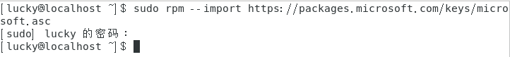  
      
- 安装储存库  
   
    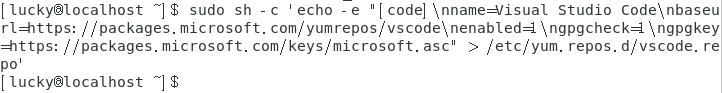  

- 然后在检查更新的同时安装VScode  
  
    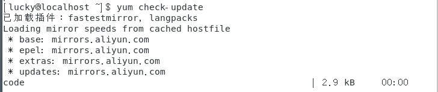  
    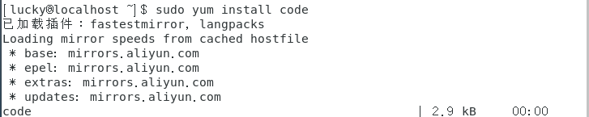  
      
- 最后在应用程序->编程里面找到它将它拖到桌面即可    
    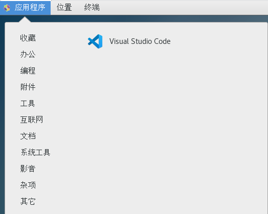  
      

## 然后用yum安装golang  
- sudo yum install golang 下载golang安装包并安装  
  
    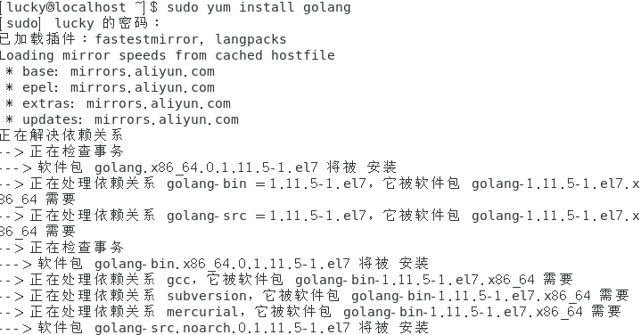  

- go version 检查安装  
  
      
      
## 接着配置go语言环境  
  
**1、创建工作空间**  
  
  
  
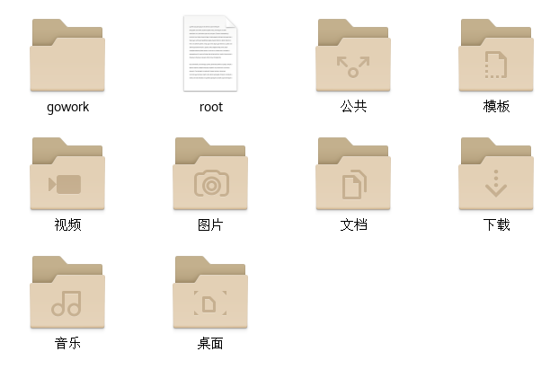  
  
**注意：工作空间目录不能与Go安装的目录相同。**  
  
**2、设置相应的GOPATH**  
- CentOs下用sudo vim打开~./profile文件，将GOPATH设置为前面创建的工作空间目录，然后将此空间的bin子目录添加到PATH中。  
    
    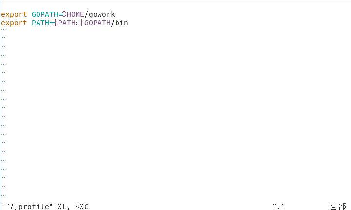
  
- 然后通过**source $HOME/.profile**执行这些设置  

      
      
- 最后通过**go env**检查配置可以看到“GOPATH”和"GOROOT"  
  
    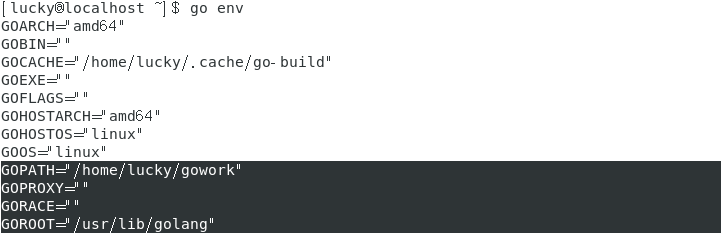  
      
## 开始Go语言编程  
- 首先要创建一个目录作为包路径，也即是放源代码的文件夹。我根据指南创建的目录为gowork/src/github.com/user/hello.  
  
    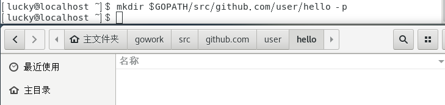  
      
- 接下来就可以编写第一个go语言程序了，在hello目录下创建一个hello.go文件，用code指令（VScode编辑器）打开。  
  
      
      
- 然后编写hello.go  
  
    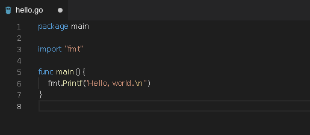  
  
- 接着用go工具构建并安装此程序  
  
    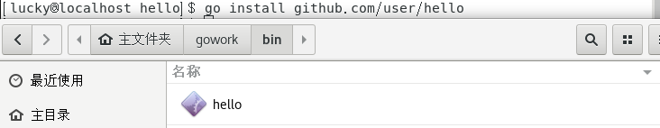  
**以上命令会构建 hello 命令，产生一个可执行的二进制文件。接着它会将该二进制文件作为 hello 安装到工作空间的 bin 目录中。**  
  
- 然后就可以在命令行输入hello的完整路径“$GOPATH/bin/hello”来执行它，同时因为我们在前面已经将bin加入到了PATH中，所以只需输入hello就可以运行该文件了。  
  
    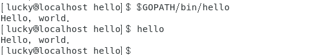  
      
## 创建Github仓库  
- 首先要安装git客户端  
  
    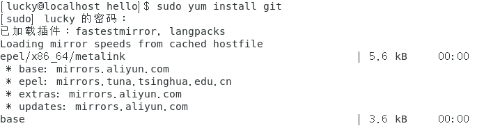  

- 通过git version检查安装  
  
      
      
- 然后进行身份验证  
  
      
      
- 接着进入前面创建的go源代码目录，使用git init 初始化本地git库  
  
      

- 然后将本地仓库与远程github仓库绑定，根据作业要求使用https协议而不用git协议。使用指令**git remote add origin https://github.com/luji17343080/Go-Learning.git** 与远程仓库绑定。最后使用指令**git remote -v**查看绑定的情况。  
  
    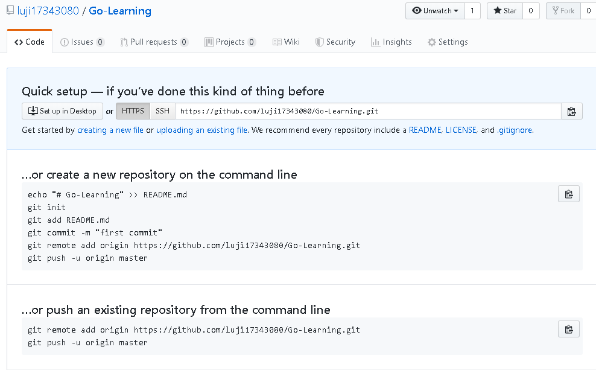  
    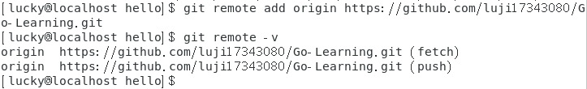  

- 为了从本地上传文件到远程仓库，首先需要将远程仓库的文件拉到本地，使用指令**git pull origin master**  
  
    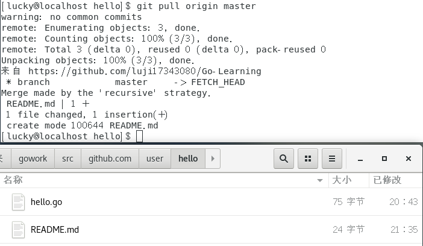  

- 然后先用指令**git add .**将本地仓库的所有文件添加到暂存区，接着用指令**git commit -m 'add .'**将暂存区的文件更新到版本库，最后通过指令**git push -u origin master**最终将本地仓库的文件同步到远程仓库。  

    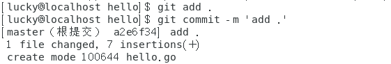  
    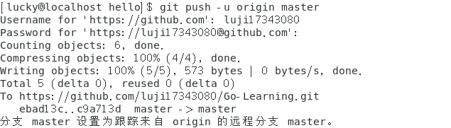  
    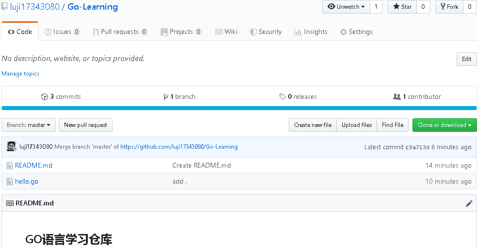  
      
## 创建自己的第一个Go语言库，让hello程序使用  
- 首先在前面建立的包路径下创建库的目录stringutil（根据指南）  
  
    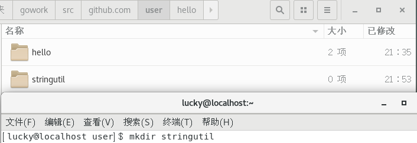  

- 接着，在该目录中创建名为 reverse.go 的文件，并用code打开。  

    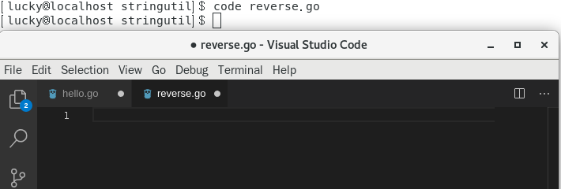  

- 然后在文件中编辑下面内容  

    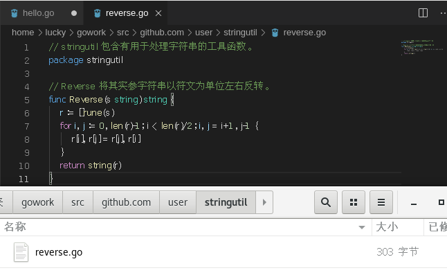  
      
- 接着用命令**go build**来测试该包的编译  
  
      
      
- 然后用命令**go install**得到可执行文件，它会将包的对象放到工作空间的 pkg 目录中  
  
    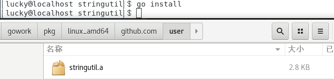  
      
- 然后修改原来的hello.go文件，使用构建完成的stringutil包  
  
    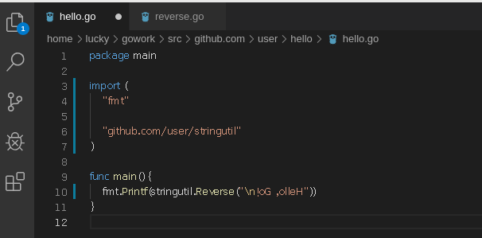  

- 然后通过指令**go install**安装stringutil包，因为无论是安装包还是二进制文件，go工具都会安装它所依赖的东西。所以我们可以直接通过重新安装hello程序，以此达到安装它所依赖的stringutil包的目的。  

      

- 最后运行新hello程序，结果与预期相同  
  
      
      
- 在上述工作完成之后，需要检查一下工作空间gowork的目录结构，为了方便检查，可以先安装工具tree。  
  
    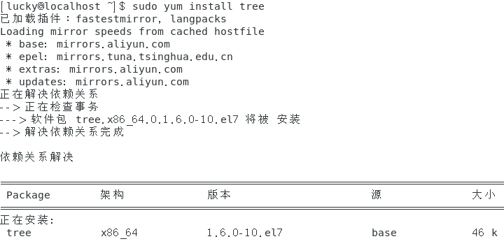  
      
- 然后在gowork目录下使用tree命令查看此时工作空间的树型目录结构  
  
    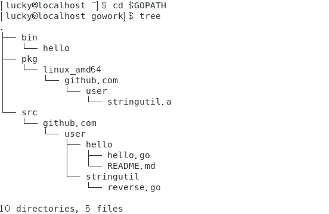  
与指南中的结构相吻合。      
  
## 用Go本身拥有的测试框架测试stringutil库  
- 先在stringutil目录下创建一个测试文件reverse_test.go，并在VScode中打开。  
  
    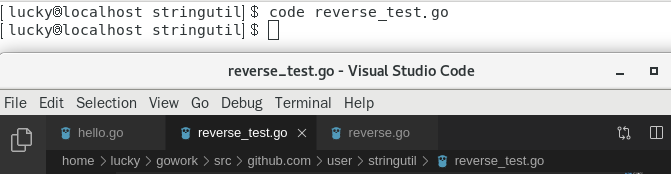  
      
- 在reverse_test.go中编写如下测试代码：
  
    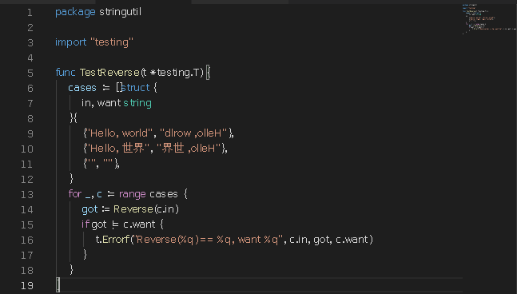  
      
- 接着用**go test**运行该测试  
  
      
      
**到此，在本地创建Go语言包并进行测试的任务就彻底完成了。**
  
## 安装 go 的一些工具  
- 若直接进入VScode进行安装会因为无法连接到golang.org而出现failed to install。为了安装这些工具，我们首先需要下载源代码到本地。在这之前，我们需要创建一个放源码的文件夹。  

    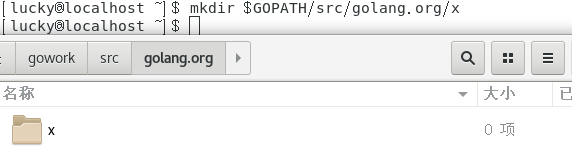  
      
- 接着下载源码并将其copy到前面建好的文件夹中。  
  
      
      
- 然后安装下载好的工具包  
  
      
      
- 接着再打开VScode，选中hello.go，按F5调式，右下角会出现Go工具安装的提示，选择**Install All**即可。  
  
    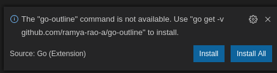  
    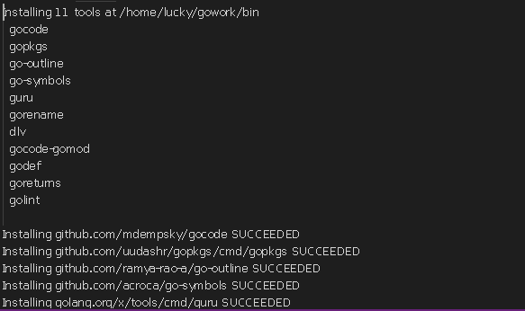  
      
- 在安装完所有工具之后，再次按F5调试，就会在下面控制台下面得到输出。  
  
    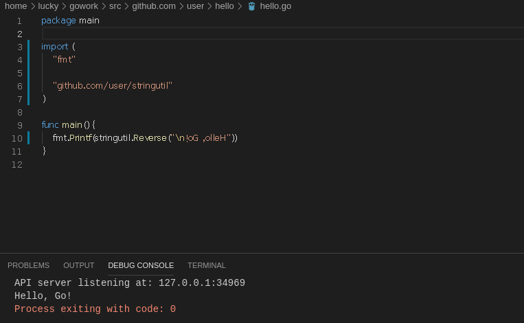  
      
    **到此，VScode上的go工具就安装完成了。**  
      
## 安装与运行go tour  
- 如果按照指南中给出的用指令**go get github.com/Go-zh/tour/gotour**安装gotour，然后用直接在命令行输入**gotour**运行会出现下面问题。  
  
      
    表示原来下载的源guthub.com/Go-zh/tour/gotour已经移到了golang.org/x/tour，所以考虑去提示的源下载gotour。  
    但是出现了下面的问题，访问这个源需要翻墙。。。  
      
    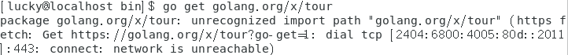  
      
- 翻墙是不可能翻墙的，这一辈子都可能翻墙的，但不是现在。不用gotour访问“Go 语言之旅”，我用tour总行吧。所以干脆直接去**github.com/Go-zh/tour**把tour相关的全部包下载下来了。但是，墙为什么总为难我。  
    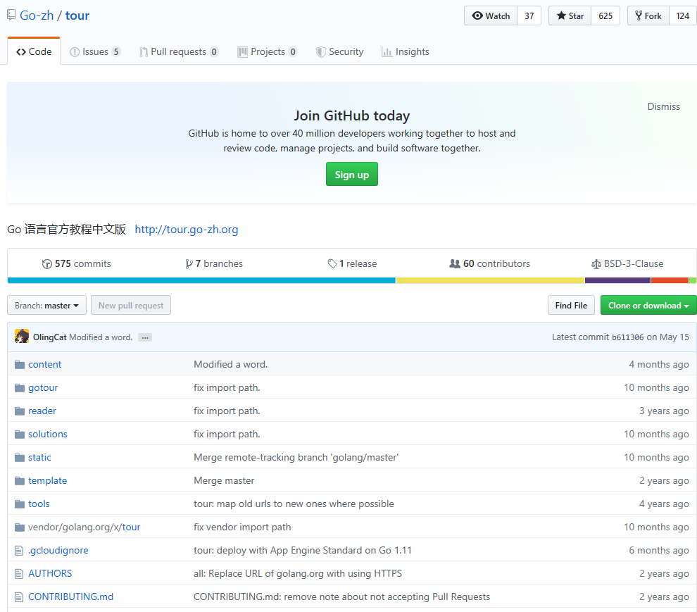  
    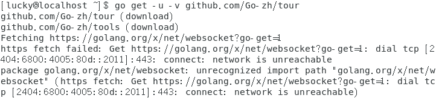  
      
- 没办法了，只能去github上单独找找net/websocket这个包了，最后在golang的官方仓库里面逮到了它，于是把它go get下来。  
  
    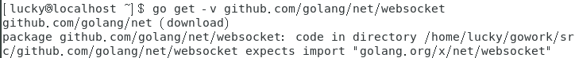  
      
    但是不幸的是又报错了，根据提示将gowork/src/github.com/golang/net/websocket移动到golang.org/x/net/websocket目录下：  

      
   
- 完成上面工作之后，重新下载tour。  
  
    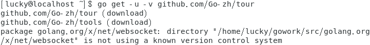  
      
    又又又报错了，目录版本出问题了，可能是copy的过程中出了问题，然后我将gowork/src/golang.org/x目录下的net文件夹删除了，接着我直接通过git clone从golang仓库将net文件夹拷贝了下来。  
      
    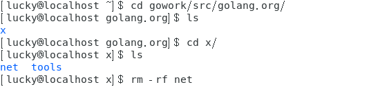  
    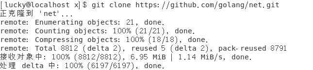  
      
- 接着再次重新下载tour  
  
    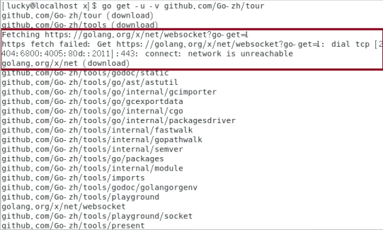  
      
    可以看到，最开始需要翻墙下载的net包已经在本地下载好了。整个过程也没有出现其他问题。  
      
- 最后，先进入gowork/bin目录下查看是否成功下载tour，发现存在tour的可执行文件，接着在命令行输入tour就成功访问了“Go 语言之旅”。
  
    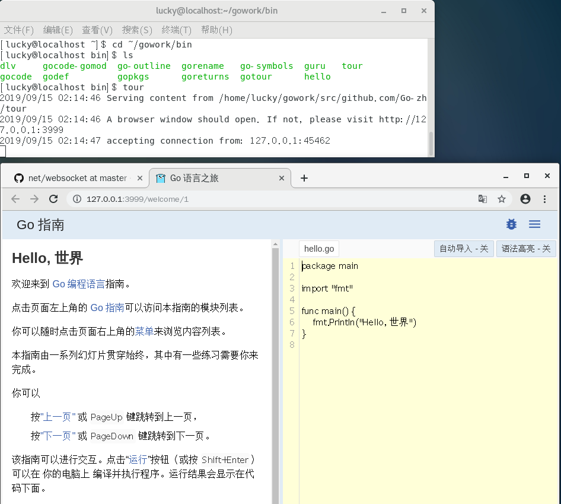

**完结撒花！！！**