# Golang 开发简单的web服务程序——cloudgo  
## 1、任务目标  
- 熟悉 go 服务器工作原理
- 基于现有 web 库，编写一个简单 web 应用类似 cloudgo。
- 使用 curl 工具访问 web 程序
- 对 web 执行压力测试  
## 2、任务要求  
- 编程 web 服务程序 类似 cloudgo 应用。
   - 要求有详细的注释
   - 是否使用框架、选哪个框架自己决定 请在 README.md 说明你决策的依据
- 使用 curl 测试，将测试结果写入 README.md
- 使用 ab 测试，将测试结果写入 README.md。并解释重要参数。  
## 3、cloudgo具体实现  
### 1. 框架安装  
我选择的框架是Iris，主要是看到Iris官网上“嚣张”的介绍：最具有未来性的web框架。Iris可以为网站、API或分布式应用程序提供美观、易于表达和易于使用的基础，是有史以来最快的web框架之一。（因为这次是做最简单的web服务程序，所以并没有体会到那种快捷，不过确实挺好用的）下面列出Iris中文官方文档给出的Iris的特性  
- 专注于高性能
- 简单流畅的API 
- 高扩展性
- 强大的路由和中间件生态系统
   - 使用iris独特的表达主义路径解释器构建RESTful API
   - 动态路径参数化或通配符路由与静态路由不冲突
   - 使用重定向选项从URL中删除尾部斜杠
   - 使用虚拟主机和子域名变得容易
   - 分组API和静态或甚至动态子域名
   - net / http和negroni-like处理程序通过iris.FromStd兼容
   - 针对任意Http请求错误 定义处理函数
   - 支持事务和回滚
   - 支持响应缓存
   - 使用简单的函数嵌入资源并与go-bindata 保持兼容 
   - mvc
- 上下文
   - 高度可扩展的试图渲染(目前支持markdown,json,xml，jsonp等等)
   - 正文绑定器和发送HTTP响应的便捷功能
   - 限制请求正文
   - 提供静态资源或嵌入式资产
   - 本地化i18N 
   - 压缩（Gzip是内置的）
- 身份验证
   - Basic Authentication
   - OAuth, OAuth2 (支持27个以上的热门网站)
   - JWT *服务器
   - 通过TLS提供服务时，自动安装和提供来自https://letsencrypt.org 的证书
   - 默认为关闭状态
   - 在关闭，错误或中断事件时注册
   - 连接多个服务器，完全兼容 net/http#Server 
- 视图系统.支持五种模板隐隐 完全兼容 html/template 
- Websocket库，其API类似于socket.io [如果你愿意，你仍然可以使用你最喜欢的]
- 热重启
- Typescript集成 + Web IDE
- Iris是最具特色的网络框架之一，并非所有功能都在这里.  
  
参考官方文档，下面给出具体的安装步骤：  
- 因为Iris的安装要求Golang的版本至少为1.8，所以需要先查看一下Golang的版本(我的为1.11)  
  
- 然后通过命令“go get -u github.com/kataras/iris” 从github上获取Iris包  
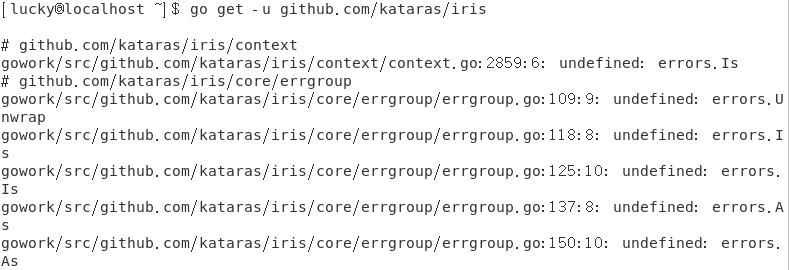  
发现会出现以上错误：其中的一些与"errors"包相关的函数未定义，而"errors"包是golang1.13版本才有的，所以需要先将golang的版本升级  
- 通过命令"sudo yum update golang"更新golang  
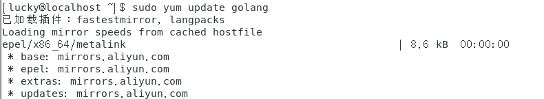  
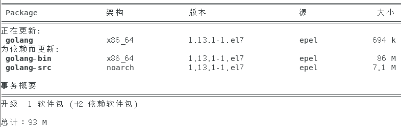  
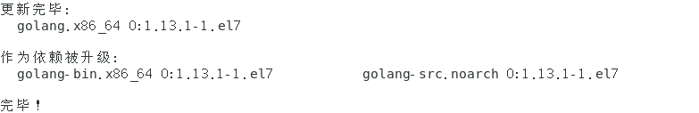  
- 然后再次"go get -u github.com/kataras/iris"就可以成功安装iris库了  
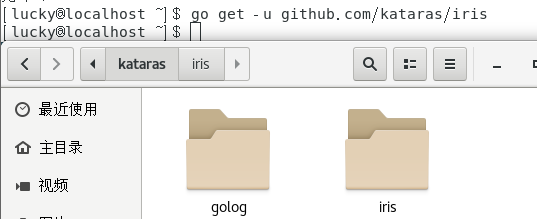  

### 2. 代码实现  
- 先在本地的gowork/src/github.com/user目录下创建一个项目文件夹cloudgo，然后在文件夹中创建server.go文件作为web服务器的源程序  
- server.go的实现结合了Iris的官方文档以及老师给出的cloudgo模板  
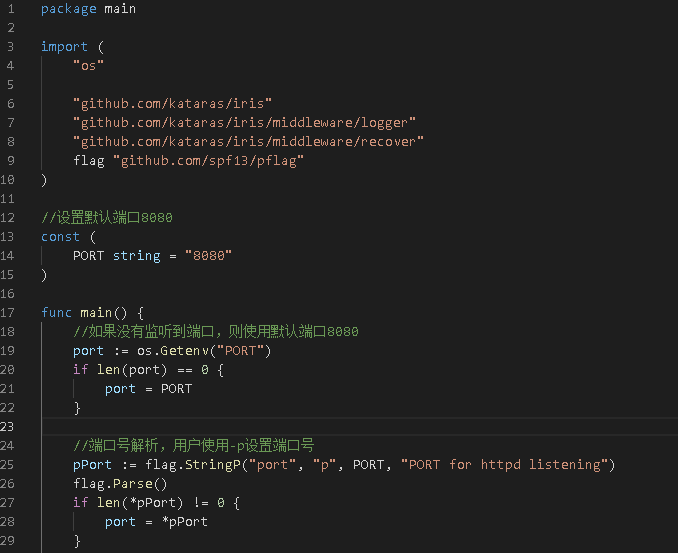  
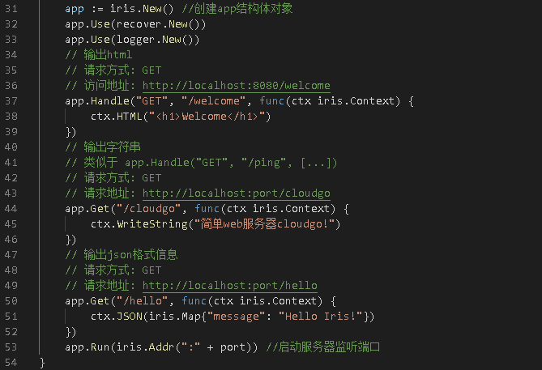  
### 3. 服务器测试  
- 运行测试：go run server.go  
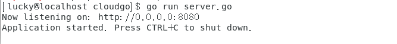  
   - 在浏览器上访问网页(端口8080)  
      - 输出html  
   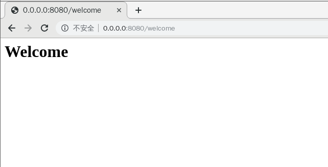  
      - 输出字符串  
   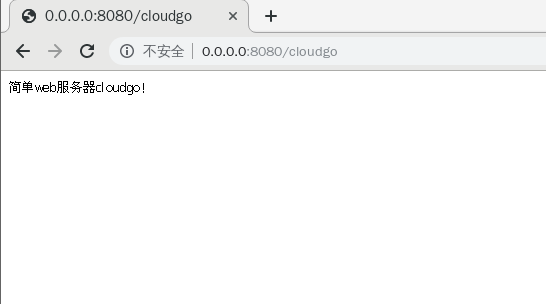  
      - 输出JSON数据  
   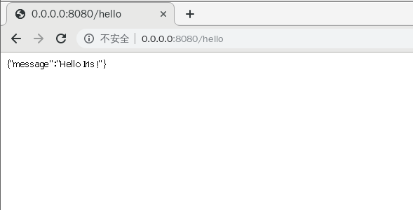  
      - 终端信息  
   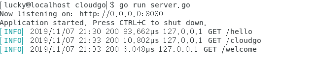  
       
   - 监听其他端口：go run server.go -p 10000  
      - 输出html  
   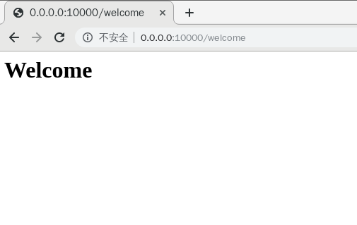  
      - 输出字符串  
   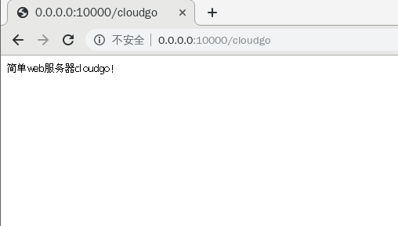  
      - 输出JSON数据    
   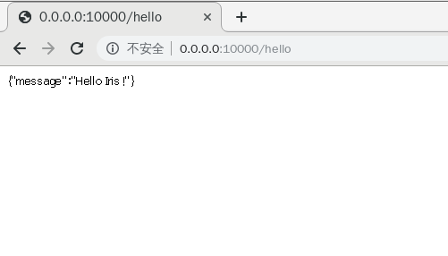  
      - 终端信息    
   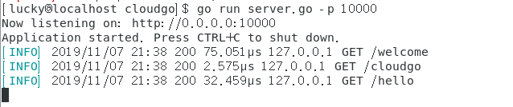  
- curl测试  
   - 首先要安装curl  
      - 通过命令"wget https://curl.haxx.se/download/curl-7.55.1.tar.gz"下载curl包  
      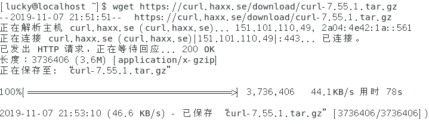  
      - 命令"tar -xzvf curl-7.55.1.tar.gz"解压curl包  
      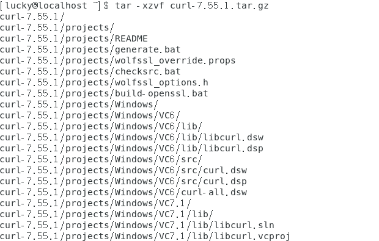  
      - 安装curl:   
      1. cd curl-7.55.1  
      2. ./configure  
      3. make  
      4. sudo make install（注意这里要用root权限）  
      5. 最终通过"curl --version"查看curl版本验证是否安装成功  
      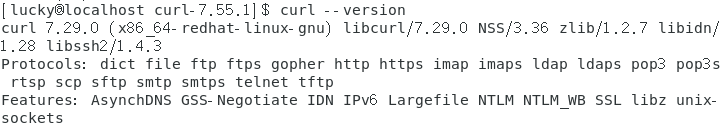  
        
   - 然后通过命令"curl -v https://0.0.0.0:10000/welcome" 测试  
   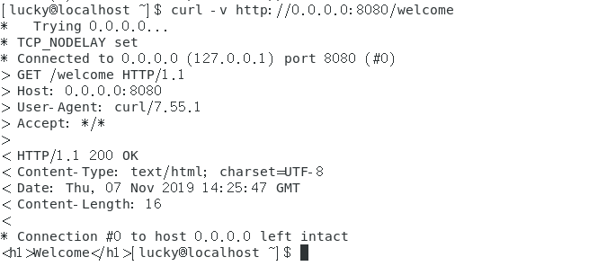  
   - 测试"curl -v https://0.0.0.0:10000/cloudgo"  
   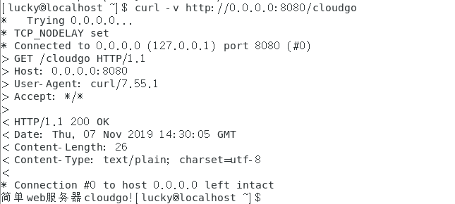  
   - 测试"curl -v https://0.0.0.0:10000/hello"  
   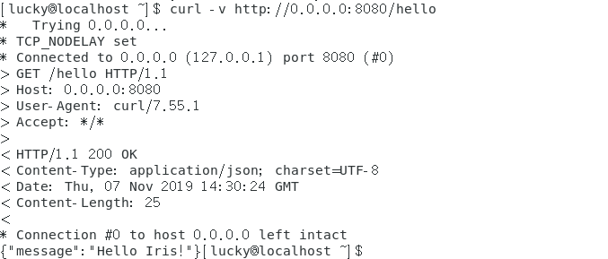  
- ab压力测试  
   - 首先仍然要通过命令"sudo yum -y install httpd-tools"安装ab  
   通过"ab -V"查看最终的安装结果如下：
   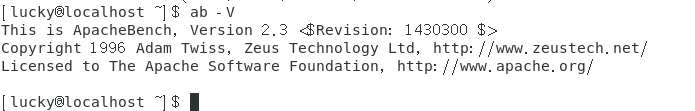  
   - 然后通过命令"ab -n 10000 -c 100 http://localhost:8080/welcome" 进行压力测试（其中10000表示测试的请求数，100代表并发等级）  
   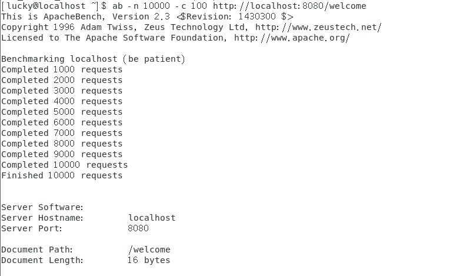  
   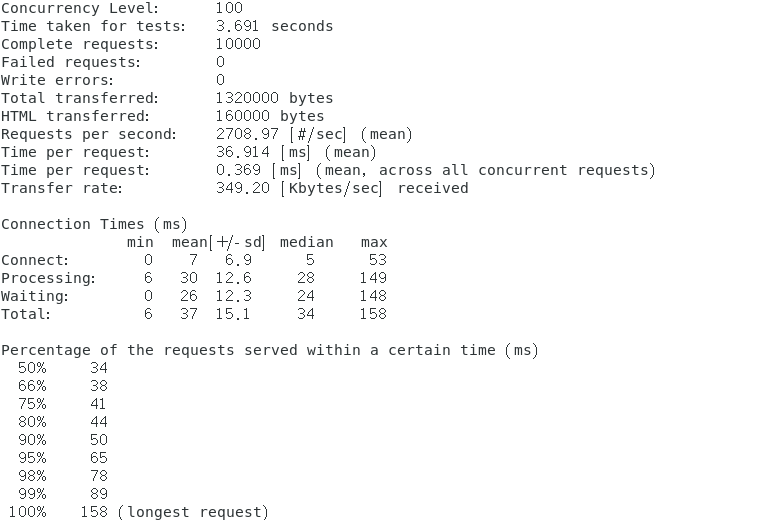  
     
   - 测试"ab -n 10000 -c 100 http://localhost:8080/cloudgo"  
   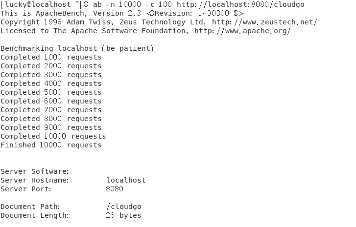  
   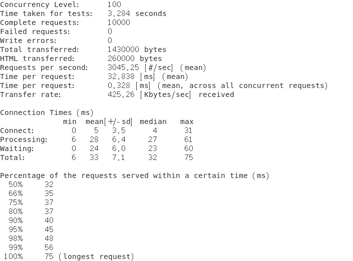  
     
   - 测试"ab -n 10000 -c 100 http://localhost:8080/hello"  
   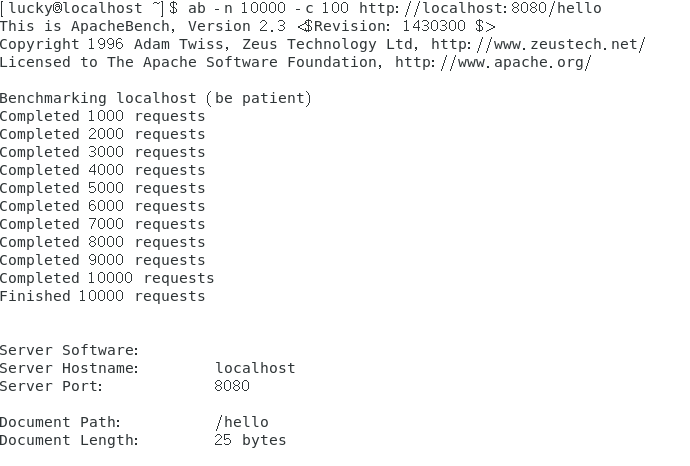  
   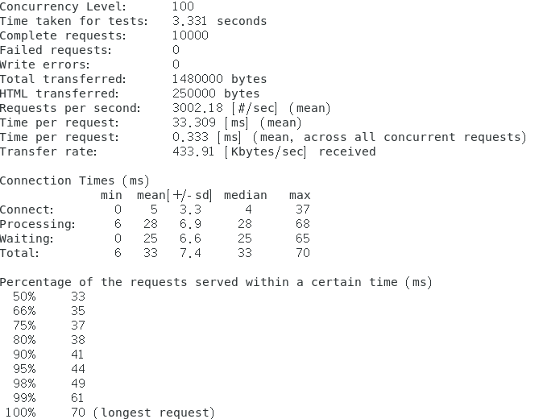  
## 4、扩展要求  
选择以下一个或多个任务，以博客的形式提交。

1.选择 net/http 源码，通过源码分析、解释一些关键功能实现  
2.选择简单的库，如 mux 等，通过源码分析、解释它是如何实现扩展的原理，包括一些 golang 程序设计技巧。  
3.在 docker hub 申请账号，从 github 构建 cloudgo 的 docker 镜像，最后在 Amazon 云容器服务中部署。  
   - 实现 Github - Travis CI - Docker hub - Amazon “不落地”云软件开发流水线  

4.其他 web 开发话题  
博客地址：

