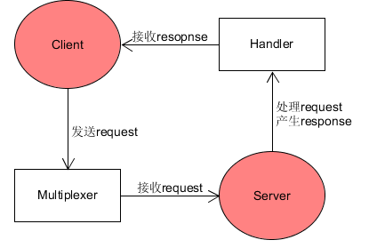
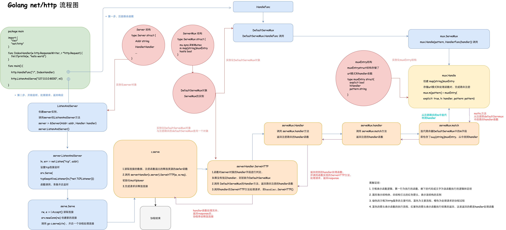

# Golang 开发简单的web服务程序——cloudgo  
## 1、任务目标  
- 熟悉 go 服务器工作原理
- 基于现有 web 库，编写一个简单 web 应用类似 cloudgo。
- 使用 curl 工具访问 web 程序
- 对 web 执行压力测试  

## 2、任务要求  
- 编程 web 服务程序 类似 cloudgo 应用。
   - 要求有详细的注释
   - 是否使用框架、选哪个框架自己决定 请在 README.md 说明你决策的依据
- 使用 curl 测试，将测试结果写入 README.md
- 使用 ab 测试，将测试结果写入 README.md。并解释重要参数。  
## 3、cloudgo具体实现  
### 1. 框架安装  
我选择的框架是Iris，主要是看到Iris官网上“嚣张”的介绍：最具有未来性的web框架。Iris可以为网站、API或分布式应用程序提供美观、易于表达和易于使用的基础，是有史以来最快的web框架之一。（因为这次是做最简单的web服务程序，所以并没有体会到那种快捷，不过确实挺好用的）下面列出Iris中文官方文档给出的Iris的特性  
- 专注于高性能
- 简单流畅的API 
- 高扩展性
- 强大的路由和中间件生态系统
   - 使用iris独特的表达主义路径解释器构建RESTful API
   - 动态路径参数化或通配符路由与静态路由不冲突
   - 使用重定向选项从URL中删除尾部斜杠
   - 使用虚拟主机和子域名变得容易
   - 分组API和静态或甚至动态子域名
   - net / http和negroni-like处理程序通过iris.FromStd兼容
   - 针对任意Http请求错误 定义处理函数
   - 支持事务和回滚
   - 支持响应缓存
   - 使用简单的函数嵌入资源并与go-bindata 保持兼容 
   - mvc
- 上下文
   - 高度可扩展的试图渲染(目前支持markdown,json,xml，jsonp等等)
   - 正文绑定器和发送HTTP响应的便捷功能
   - 限制请求正文
   - 提供静态资源或嵌入式资产
   - 本地化i18N 
   - 压缩（Gzip是内置的）
- 身份验证
   - Basic Authentication
   - OAuth, OAuth2 (支持27个以上的热门网站)
   - JWT *服务器
   - 通过TLS提供服务时，自动安装和提供来自https://letsencrypt.org 的证书
   - 默认为关闭状态
   - 在关闭，错误或中断事件时注册
   - 连接多个服务器，完全兼容 net/http#Server 
- 视图系统.支持五种模板隐隐 完全兼容 html/template 
- Websocket库，其API类似于socket.io [如果你愿意，你仍然可以使用你最喜欢的]
- 热重启
- Typescript集成 + Web IDE
- Iris是最具特色的网络框架之一，并非所有功能都在这里.  
  
参考官方文档，下面给出具体的安装步骤：  
- 因为Iris的安装要求Golang的版本至少为1.8，所以需要先查看一下Golang的版本(我的为1.11)  
  
- 然后通过命令“go get -u github.com/kataras/iris” 从github上获取Iris包  
  
发现会出现以上错误：其中的一些与"errors"包相关的函数未定义，而"errors"包是golang1.13版本才有的，所以需要先将golang的版本升级  
- 通过命令"sudo yum update golang"更新golang  
  
  
  
- 然后再次"go get -u github.com/kataras/iris"就可以成功安装iris库了  
  

### 2. 代码实现  
- 先在本地的gowork/src/github.com/user目录下创建一个项目文件夹cloudgo，然后在文件夹中创建server.go文件作为web服务器的源程序  
- server.go的实现结合了Iris的官方文档以及老师给出的cloudgo模板  
  
  
### 3. 服务器测试  
- 运行测试：go run server.go  
  
   - 在浏览器上访问网页(端口8080)  
      - 输出html  
     
      - 输出字符串  
     
      - 输出JSON数据  
     
      - 终端信息  
     
       
   - 监听其他端口：go run server.go -p 10000  
      - 输出html  
     
      - 输出字符串  
     
      - 输出JSON数据    
     
      - 终端信息    
     
- curl测试  
   - 首先要安装curl  
      - 通过命令"wget https://curl.haxx.se/download/curl-7.55.1.tar.gz"下载curl包  
        
      - 命令"tar -xzvf curl-7.55.1.tar.gz"解压curl包  
        
      - 安装curl:   
      1. cd curl-7.55.1  
      2. ./configure  
      3. make  
      4. sudo make install（注意这里要用root权限）  
      5. 最终通过"curl --version"查看curl版本验证是否安装成功  
        
        
   - 然后通过命令"curl -v https://0.0.0.0:10000/welcome" 测试  
     
   - 测试"curl -v https://0.0.0.0:10000/cloudgo"  
     
   - 测试"curl -v https://0.0.0.0:10000/hello"  
     
- ab压力测试  
   - 首先仍然要通过命令"sudo yum -y install httpd-tools"安装ab  
   通过"ab -V"查看最终的安装结果如下：
     
   - 然后通过命令"ab -n 10000 -c 100 http://localhost:8080/welcome" 进行压力测试（其中10000表示测试的请求数，100代表并发等级）  
     
     
     
   - 测试"ab -n 10000 -c 100 http://localhost:8080/cloudgo"  
     
     
     
   - 测试"ab -n 10000 -c 100 http://localhost:8080/hello"  
     
     
     
## 4、扩展要求  
选择以下一个或多个任务，以博客的形式提交。

1.选择 net/http 源码，通过源码分析、解释一些关键功能实现  
2.选择简单的库，如 mux 等，通过源码分析、解释它是如何实现扩展的原理，包括一些 golang 程序设计技巧。  
3.在 docker hub 申请账号，从 github 构建 cloudgo 的 docker 镜像，最后在 Amazon 云容器服务中部署。  
   - 实现 Github - Travis CI - Docker hub - Amazon “不落地”云软件开发流水线  

4.其他 web 开发话题  
  
### net/http源码分析  
  
#### 4.1 http服务器处理流程
总的来说，http服务器的作用过程就是用`server（服务端）`处理来自`client（客户端）`的`request`，并向`client`返回`response`。其中，`server`接收`request`需要通过路由（`Multiplexer`）实现，而对`request`的处理以及`response`的产生则是通过其中的`Handler`函数实现（例子中是通过调用HandleFunc函数实现`http`包中默认的`Multiplexer`：`DefautServeMux`）.下图为简单的流程图：  
    


---

#### 4.2 http服务创建

以下面最简单的Golang `http`测试代码为例，创建一个http服务，有两个主要过程：
   - 注册路由（`DefautServeMux`），即把一个模式（`url`）和对应的处理函数（`handler`）注册到`DefautServeMux`中
   - 实例化一个server对象，并开启对客户端的监听，对服务端的请求做出响应
```go
package main

import(
   "fmt"
   "net/http"
)

func IndexHandler(w http.ResponseWriter, r *http.Request) { // 定义处理器函数
   fmt.Fprintln(w, "Hello World")
}

func main() {
   http.HandleFunc("/", IndexHandler)  // 注册路由
   http.ListenAndServer("127.0.0.0:8080", nil)  // 监听
}
```      
---

##### 4.2.1 注册路由

因为http包中已经内置了路由：`DefaultServeMux`，所以可以直接调用`http.HandleFunc`函数注册一个处理器函数（`handler`）和对应的模式（`pattern`）到`DefaultServeMux`中。（当然，也可以自定义一个路由器，如：`mux := http.NewServeMux()`）

```go
func HandleFunc(pattern string, handler func(ResponseWriter, *Request)) {
    DefaultServeMux.HandleFunc(pattern, handler)
}
```

```go
// NewServeMux allocates and returns a new ServeMux.
func NewServeMux() *ServeMux { return new(ServeMux) }

// DefaultServeMux is the default ServeMux used by Serve.
var DefaultServeMux = &defaultServeMux

var defaultServeMux ServeMux
```  

由上面代码可以看到，`DefaultServeMux`其实就是一个默认的`ServeMux`（多路复用路由器）的实例，`ServeMux`的结构如下：  

```go
type ServeMux struct {
    mu    sync.RWMutex  // 并发处理涉及到的锁
    m     map[string]muxEntry // map的key(string)为一些url模式，value是一个muxEntry
    hosts bool // 判断是否在任意的规则下带有host信息
}
```  

`muxEntry`的结构如下：  

```go
type muxEntry struct {
    explicit bool // 判断是否精确匹配
    h        Handler // 路由器匹配的Handler
    pattern  string  // 路由器匹配的url模式
}
```
同时，`DefaultServeMux`中的`HandleFunc(pattern, handler)`方法实际是定义在`ServeMux`中的：  

```go
func (mux *ServeMux) HandleFunc(pattern string, handler func(ResponseWriter, *Request)) {
	mux.Handle(pattern, HandlerFunc(handler))
}
```

其中，`HandlerFunc(handler)`是一个转换函数类型，即实现了`Handler`接口的`ServeHTTP`方法,转变成了一个handler处理器。任何结构体，只要实现了ServeHTTP方法，这个结构就可以称之为handler对象。ServeMux会使用handler并调用其ServeHTTP方法处理请求并返回响应。  

```go
// The HandlerFunc type is an adapter to allow the use of ordinary functions as HTTP handlers. If f is a function
// with the appropriate signature, HandlerFunc(f) is a Handler that calls f.
type HandlerFunc func(ResponseWriter, *Request)

// ServeHTTP calls f(w, r).
func (f HandlerFunc) ServeHTTP(w ResponseWriter, r *Request) {
	f(w, r)
}
```  
```go
type Handler interface {
    ServeHTTP(ResponseWriter, *Request)
}
```
除此之外，上面的函数还调用了`ServeMux`的`Handle`方法(`mux.Handle`)，将`pattern`和`handler`函数做了一个`map`映射。mux中的Handle函数如下：

```go
// Handle registers the handler for the given pattern.
// If a handler already exists for pattern, Handle panics.
func (mux *ServeMux) Handle(pattern string, handler Handler) {
    mux.mu.Lock()
    defer mux.mu.Unlock()
    if pattern == "" {
        panic("http: invalid pattern " + pattern)
    }
    if handler == nil {
        panic("http: nil handler")
    }
    if mux.m[pattern].explicit { // 如果pattern与handler匹配
        panic("http: multiple registrations for " + pattern)
    }

    if mux.m == nil {   // 如果map不存在，则建立map
        mux.m = make(map[string]muxEntry)
    }
    // 判断pattern与handler是否精确匹配
    mux.m[pattern] = muxEntry{explicit: true, h: handler, pattern: pattern}

    if pattern[0] != '/' {
        mux.hosts = true
    }

    n := len(pattern)
    if n > 0 && pattern[n-1] == '/' && !mux.m[pattern[0:n-1]].explicit {

        path := pattern
        if pattern[0] != '/' {
            path = pattern[strings.Index(pattern, "/"):]
        }
        url := &url.URL{Path: path}
        mux.m[pattern[0:n-1]] = muxEntry{
            h: RedirectHandler(url.String(),StatusMovedPermanently), pattern: pattern
        }
	}
}    
```

由上面代码可以看到，`Handle函数`的作用是把一个URL模式(`pattern`)和与其匹配的处理函数(`handler`)绑定到`muxEntry`的`map`上，这个`map`就相当于一个`pattern`和`handler`的匹配表。这个表是在`ServeMux`结构中的，而前面提到了`DefaultServeMux`是`ServeMux`的一个实例，因此，调用`HandleFunc(pattern, handler)`方法最终`pattern`和其对应的`handler`绑定到了`DefautServeMux`中，这就代表路由注册完毕了。

---
##### 4.2.2 监听并处理请求

直接通过调用`ListenAndServe`函数监听，函数代码如下：

```go
func ListenAndServe(addr string, handler Handler) error {
	server := &Server{Addr: addr, Handler: handler}
	return server.ListenAndServe()
}
```  
可以看到，函数先实例化了一个Server对象server（Server定义了`http`服务端运行的一些参数），其结构体如下：
```go
type Server struct {
   Addr           string        // 监听的TCP地址，如果为空字符串会使用":http"
   Handler        Handler       // 处理器，默认为DefaultServeMux中的Handler
   ReadTimeout    time.Duration // 读request允许的最长持续时间
   WriteTimeout   time.Duration // 写response允许的最长持续时间
   MaxHeaderBytes int           // 请求的头域最大长度，如为0则用DefaultMaxHeaderBytes
   TLSConfig      *tls.Config   // 可选的TLS配置，用于ListenAndServeTLS方法

   TLSNextProto map[string]func(*Server, *tls.Conn, Handler)  // TLSNextProto（可选地）指定一个函数来在一个NPN型协议升级出现时接管TLS连接的所有权。

   ConnState func(net.Conn, ConnState) //用于指定一个可选的回调函数，该函数会在一个与客户端的连接改变状态时被调用

   ErrorLog *log.Logger // ErrorLog指定一个可选的日志记录器，用于记录接收连接时的错误和处理器不正常的行为
}
```  
然后，`ListenAndServe`通过调用`(Server) ListenAndServe()`函数对服务器地址进行监听，函数代码如下：  

```go
func (srv Server) ListenAndServe() error {
	addr := srv.Addr
	if addr == "" { // 如果地址为空，则使用":http"
		addr = ":http"
	}
	ln, err := net.Listen("tcp", addr) // 调用net.Listen函数监听地址addr
	if err != nil {
		return err
	}
	return srv.Serve(tcpKeepAliveListener{ln.(net.TCPListener)}) // 接受客户端的request
}
```
其中，`net.Listen`函数的源码如下，传入参数为一个网络环境network（`tcp`、`tcp4`、`unix`等流网络）和一个监听地址address，返回一个`Listener`和错误处理`error`  

```go  
func Listen(network, address string) (Listener, error) {
	addrs, err := DefaultResolver.resolveAddrList(context.Background(), "listen", network, address, nil)
	if err != nil {
		return nil, &OpError{Op: "listen", Net: network, Source: nil, Addr: nil, Err: err}
	}
	var l Listener
	switch la := addrs.first(isIPv4).(type) {
	case *TCPAddr:
		l, err = ListenTCP(network, la)
	case *UnixAddr:
		l, err = ListenUnix(network, la)
	default:
		return nil, &OpError{Op: "listen", Net: network, Source: nil, Addr: la, Err: &AddrError{Err: "unexpected address type", Addr: address}}
	}
	if err != nil {
		return nil, err
	}
	return l, nil
}
```
最后调用`srv.Serve(tcpKeepAliveListener{ln.(net.TCPListener)})`函数来接收`Client`的`request`，其源码如下：  
```go
func (srv *Server) Serve(l net.Listener) error {
	defer l.Close()
	var tempDelay time.Duration // how long to sleep on accept failure
	for {
		rw, e := l.Accept() //通过Listener接收请求
		if e != nil {
			if ne, ok := e.(net.Error); ok && ne.Temporary() {
				if tempDelay == 0 {
					tempDelay = 5 * time.Millisecond
				} else {
					tempDelay *= 2
				}
				if max := 1 * time.Second; tempDelay > max {
					tempDelay = max
				}
				log.Printf("http: Accept error: %v; retrying in %v", e, tempDelay)
				time.Sleep(tempDelay)
				continue
			}
			return e
		}
		tempDelay = 0
		c, err := srv.newConn(rw) // 通过newConn函数创建一个Conn。Conn是net包里面的一个接口，代表通用的面向流的网络连接。多个线程可能会同时调用同一个Conn的方法。
		if err != nil {
			continue
		}
		go c.serve() 
	}
}
```

---  
最后的最后，看了一篇博客（[链接](https://blog.csdn.net/lengyuezuixue/article/details/79094323)）给出的Golang `http`服务的整体框架，感觉很nice，在这里贴出来。  
  



