# `Docker` 容器技术
### `容器技术` 与 `LXC`
- `Unix` 系统为了实现多用户的`隔离`，建立了丰富的 `OS` 级别虚拟化机制
- `LXC` 是 `Linux® Containers` 简称，是 `OS` 虚拟化的集成与发展

### `Docker` 引擎隔离技术（进程级别隔离技术）
`Docker`使用一种称为`namespace`的技术来提供称为容器的`隔离工作区`。
- `namespace`
   - `pid namespace`: 进程隔离 (PID: Process ID).
   - `net namespace`: 管理网络接口(NET: Networking).
   - `ipc namespace`: 管理IPC资源访问(IPC: InterProcess Communication).
   - `mnt namespace`: 管理文件系统挂载点 (MNT: Mount).
   - `uts namespace`: 隔离内核与版本识别 (UTS: Unix Timesharing System).
- `Control Groups`: 限定容器内存等资源
- `Union FS`： 联合文件系统
- `Container format`： 容器文件格式（OCF）

### `Docker` 的优点
- `灵活`：即使是最复杂的应用也可以容器化。
- `轻量级`：容器利用并共享主机操作系统内核。
- `可互换`：您可以即时部署更新和升级。
- `便携式`：您可以在本地构建，部署到云，在任何地方运行。
- `可扩展`：您可以增加并自动分发容器副本。
- `可组合`：您可以自由地组合（stack）服务  
  
下面是一张使用`Docker`引擎的`OS`和使用一般的`虚拟机监控程序`的`OS`的性能比较图：

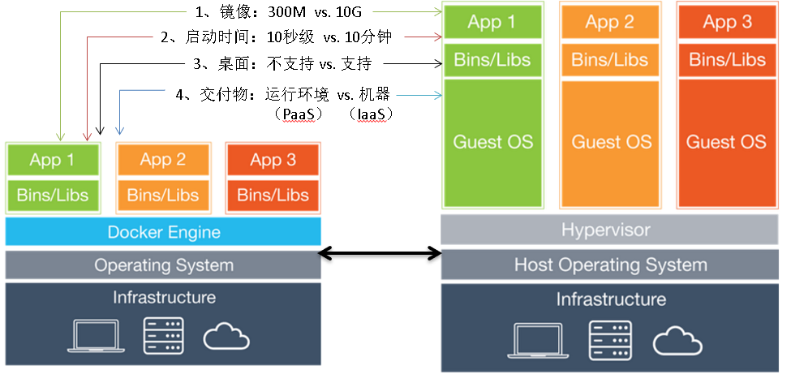  
  
### `Docker` 的核心概念
- `镜像`(image) – 类比`执行程序`  
一个`可执行包`: 包含运行应用程序所需的一切——`代码`、`运行环境`、`库`、`环境变量`和`配置文件`  

- `容器`(Container) – 类比`进程`  
是`镜像`的`runtime`实例——`镜像`在执行时在内存中会变成什么样子(即带有`状态`的`镜像`或`用户进程`)  

- `仓库`（Registry）– 类比 `repository`  
存放不同版本`镜像`的地方  

- `主机`（Host / Node）  
运行容器的`服务器`  

- `服务`（Service）  
一个镜像之上运行的一组可伸缩的`容器集合`，运行在一个容器集群中提供`同一功能服务`  

- `栈`（Stack）/ `命名空间`（Namaspace） / `应用`（Application）  
被编排的、可伸缩的一组`相互依赖的服务`，构成的一个`应用`  
  
- `Docker`工作原理示意图：
  
      

### `Docker` 安装（`CentOS 7`）  

先升级内核  
- 升级前的版本如下：

      

- 导入`Key`
    
    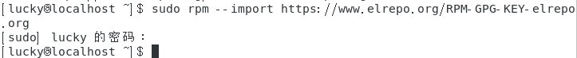  

- 安装`elrepo`的`yum源`

    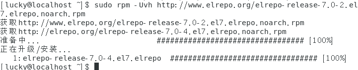  

- 安装`内核`
   - 发现有`yum`进程在执行

        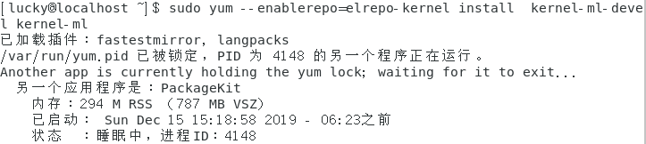  
   - 强制关掉`yum`进程，然后重启  
    
          
    
   - 重新安装`内核`

        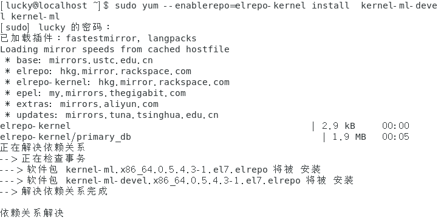  
        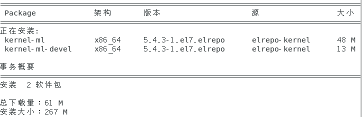
          

   - 查看`默认启动程序`，设置启动顺序从`0`开始  

        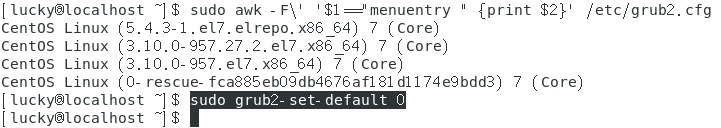  

   - `重启`虚拟机，使用新的内核
  
          

   - 最后再删除`旧内核`

        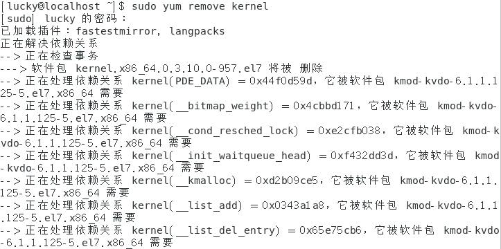  
        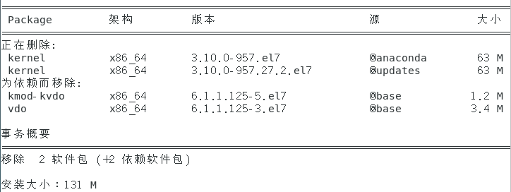
        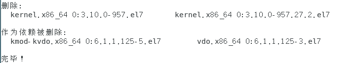  

然后卸载旧版本的`Docker`（我没安装过，这步省略）

接着用`阿里云源`安装`Docker`  
- `Set up repository`  

    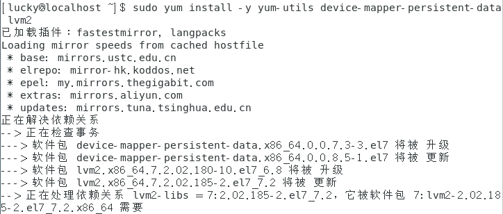  
    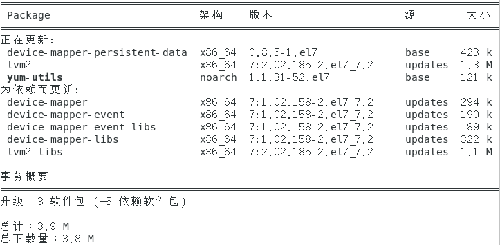
    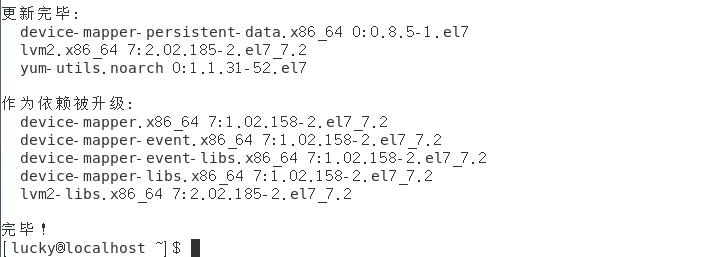

- `Use Aliyun Docker`  

    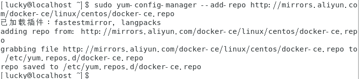  

- 安装最新版的`Docker`  

    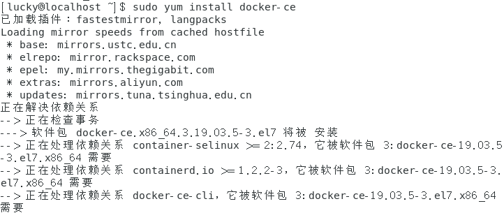  
    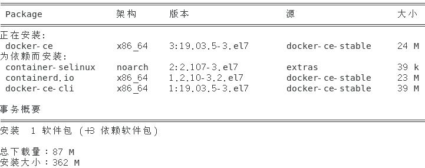  
    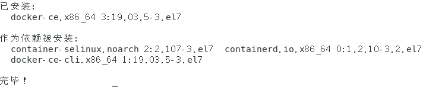  

然后设置`文件系统`为官方推荐的`overlay2`： `sudo vim /usr/lib/systemd/system/docker.service`
```
#ExecStart=/usr/bin/docker daemon  -H fd:// --insecure-registry hub.03in.com:5002
ExecStart=/usr/bin/dockerd -s overlay2  --insecure-registry hub.03in.com:5002
```
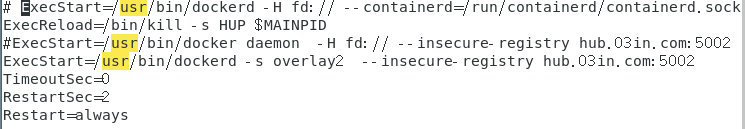  

最后启动`docker`
- 设置`开机启动`: `systemctl enable docker`

    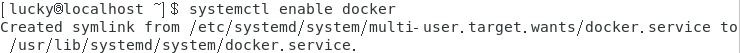  

- 启动`docker`：`systemctl start docker`  

      

- 查看docker的`启动状态`：`systemctl status docker`

    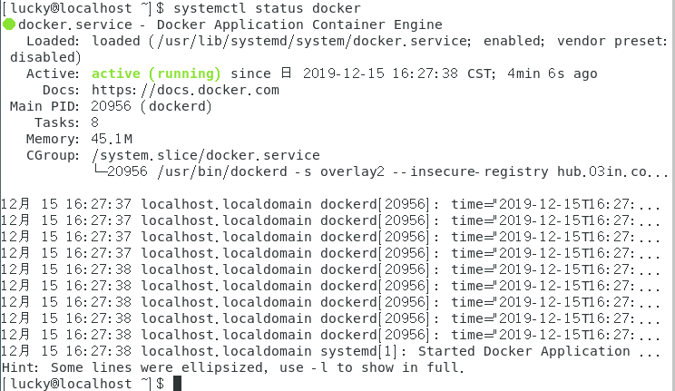  

- 重新加载设置、重启引擎  
`systemctl daemon-reload`  
`systemctl restart docker`  

      

- 检查`docker`环境：`sudo docker version`  

    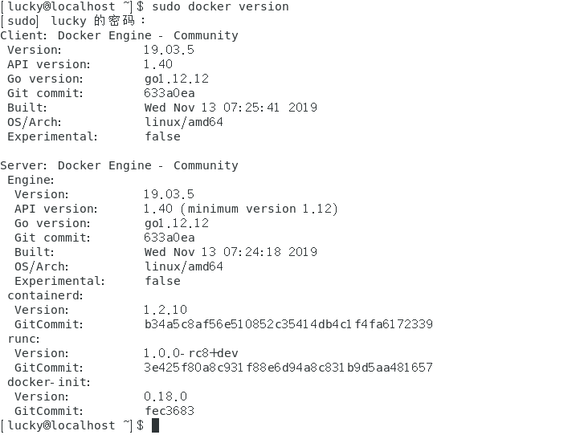  

- 运行`容器`（`镜像`）：`sudo docker run hello-world`  
   - `hello-world`  

        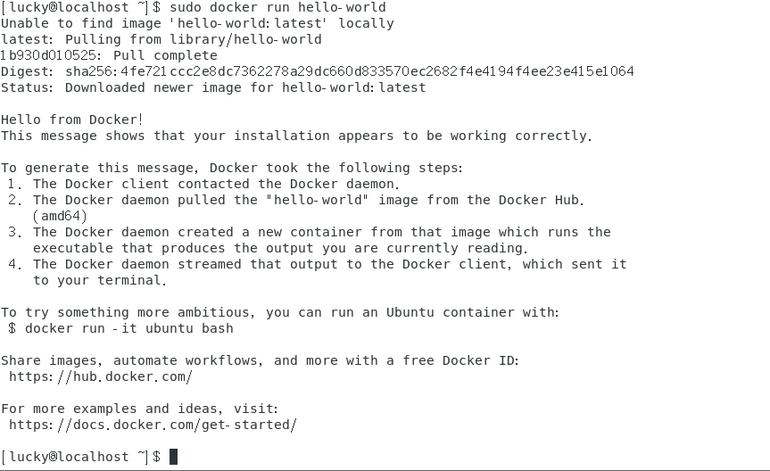  
  
   - `ubuntu bash`  

        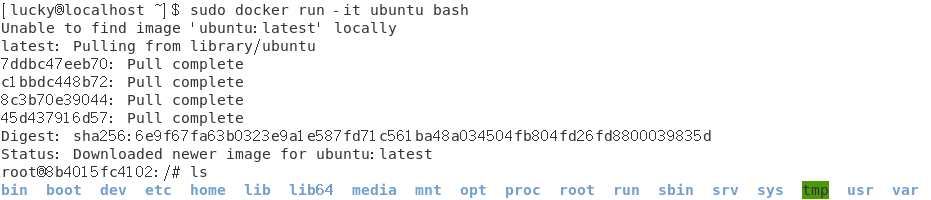  

### `Docker` 基本操作
- 显示本地`镜像库`内容：`sudo docker images（等价于docker images ls）`  

    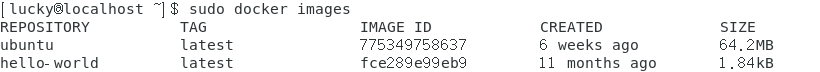  

- 显示运行中的`容器`：`docker ps（等价于docker container ls）`

      

- 显示`所有容器`：`docker ps -a`  

    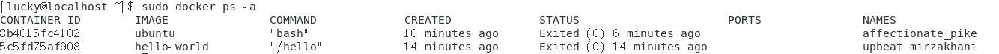  

- 继续运行原容器并进入  
`sudo docker restart [container name]`  
`sudo docker ps`  
`sudo docker attach [container name]`  

    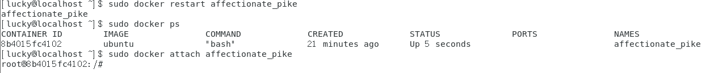

### `MySQL` 与 `容器化`
- 拉取`MySQL`镜像：`sudo docker pull mysql:5.7`  

    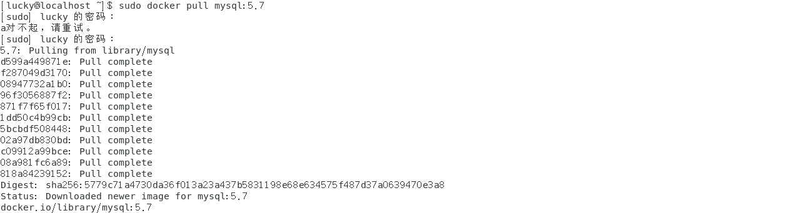  

- 启动`MySQL`容器：`sudo docker run mysql:5.7`  

    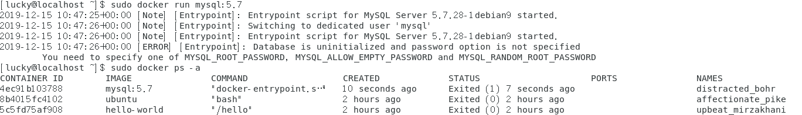  

- 查看现在的`image`信息：`sudo docker images`

      

- `MySQL`的容器构建文件`Dockerfile`如下：
    ```docker
    FROM debian:stretch-slim
    # add our user and group first to make sure their IDs get assigned consistently, regardless of whatever dependencies get added

    RUN groupadd -r mysql && useradd -r -g mysql mysql

    RUN apt-get update && apt-get install -y --no-install-recommends gnupg dirmngr && rm -rf /var/lib/apt/lists/*
    # add gosu for easy step-down from root

    ENV GOSU_VERSION 1.7

    RUN set -x \
        && apt-get update && apt-get install -y --no-install-recommends ca-certificates wget && rm -rf /var/lib/apt/lists/* \
        && wget -O /usr/local/bin/gosu "https://github.com/tianon/gosu/releases/download/$GOSU_VERSION/gosu-$(dpkg --print-architecture)" \
        && wget -O /usr/local/bin/gosu.asc "https://github.com/tianon/gosu/releases/download/$GOSU_VERSION/gosu-$(dpkg --print-architecture).asc" \
        && export GNUPGHOME="$(mktemp -d)" \
        && gpg --batch --keyserver ha.pool.sks-keyservers.net --recv-keys B42F6819007F00F88E364FD4036A9C25BF357DD4 \
        && gpg --batch --verify /usr/local/bin/gosu.asc /usr/local/bin/gosu \
        && gpgconf --kill all \
        && rm -rf "$GNUPGHOME" /usr/local/bin/gosu.asc \
        && chmod +x /usr/local/bin/gosu \
        && gosu nobody true \
        && apt-get purge -y --auto-remove ca-certificates wget

    RUN mkdir /docker-entrypoint-initdb.d

    RUN apt-get update && apt-get install -y --no-install-recommends \
    # for MYSQL_RANDOM_ROOT_PASSWORD
            pwgen \
    # for mysql_ssl_rsa_setup
            openssl \
    # FATAL ERROR: please install the following Perl modules before executing /usr/local/mysql/scripts/mysql_install_db:
    # File::Basename
    # File::Copy
    # Sys::Hostname
    # Data::Dumper
            perl \
        && rm -rf /var/lib/apt/lists/*

    RUN set -ex; \
    # gpg: key 5072E1F5: public key "MySQL Release Engineering <mysql-build@oss.oracle.com>" imported
        key='A4A9406876FCBD3C456770C88C718D3B5072E1F5'; \
        export GNUPGHOME="$(mktemp -d)"; \
        gpg --batch --keyserver ha.pool.sks-keyservers.net --recv-keys "$key"; \
        gpg --batch --export "$key" > /etc/apt/trusted.gpg.d/mysql.gpg; \
        gpgconf --kill all; \
        rm -rf "$GNUPGHOME"; \
        apt-key list > /dev/null

    ENV MYSQL_MAJOR 5.7

    ENV MYSQL_VERSION 5.7.28-1debian9

    RUN echo "deb http://repo.mysql.com/apt/debian/ stretch mysql-${MYSQL_MAJOR}" > /etc/apt/sources.list.d/mysql.list
    # the "/var/lib/mysql" stuff here is because the mysql-server postinst doesn't have an explicit way to disable the mysql_install_db codepath besides having a database already "configured" (ie, stuff in /var/lib/mysql/mysql)
    # also, we set debconf keys to make APT a little quieter

    RUN { \
            echo mysql-community-server mysql-community-server/data-dir select ''; \
            echo mysql-community-server mysql-community-server/root-pass password ''; \
            echo mysql-community-server mysql-community-server/re-root-pass password ''; \
            echo mysql-community-server mysql-community-server/remove-test-db select false; \
        } | debconf-set-selections \
        && apt-get update && apt-get install -y mysql-server="${MYSQL_VERSION}" && rm -rf /var/lib/apt/lists/* \
        && rm -rf /var/lib/mysql && mkdir -p /var/lib/mysql /var/run/mysqld \
        && chown -R mysql:mysql /var/lib/mysql /var/run/mysqld \
    # ensure that /var/run/mysqld (used for socket and lock files) is writable regardless of the UID our mysqld instance ends up having at runtime
        && chmod 777 /var/run/mysqld \
    # comment out a few problematic configuration values
        && find /etc/mysql/ -name '*.cnf' -print0 \
            | xargs -0 grep -lZE '^(bind-address|log)' \
            | xargs -rt -0 sed -Ei 's/^(bind-address|log)/#&/' \
    # don't reverse lookup hostnames, they are usually another container
        && echo '[mysqld]\nskip-host-cache\nskip-name-resolve' > /etc/mysql/conf.d/docker.cnf

    VOLUME /var/lib/mysql

    COPY docker-entrypoint.sh /usr/local/bin/

    RUN ln -s usr/local/bin/docker-entrypoint.sh /entrypoint.sh # backwards compat

    ENTRYPOINT ["docker-entrypoint.sh"]

    EXPOSE 3306 33060

    CMD ["mysqld"]
    ```  
    **指令用法**：
    - `FROM` base_image
    - `RUN` shell_commands
    - `ENV` env_vars
    - `VOLUME` path
    - `COPY` source destination
    - `ENTRYPOINT` [“executable”,”parm1”, ”parm2”,…]
    - `EXPOSE` ports
    - `CMD` [“executable”,”parm1”, ”parm2”,…]  

### 构建 `Docker`  
- 先创建容器构建`目录`以及构建文件`dockerfile`  
  
      

- 在`dockerfile`中写入以下内容

      

- `构建`镜像：`sudo docker build . -t hello`

    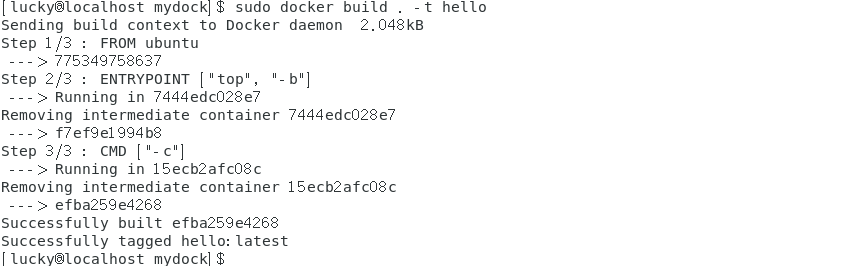  

- `运行`镜像：`sudo docker run -it --rm hello -H`  

    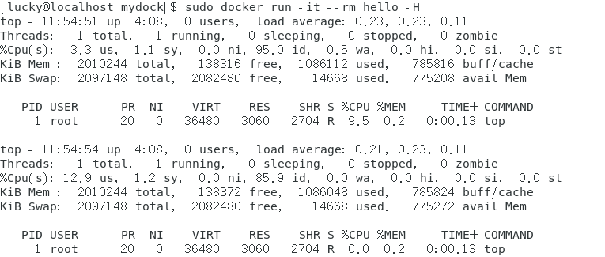  

### 使用`MySQL`容器  
- `启动`服务器：`sudo docker run -p 3306:3306 --name mysql2 -e MYSQL_ROOT_PASSWORD=root -d mysql:5.7`  

    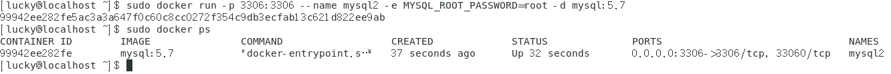  


- 启动 MySQL `客户端`  
`sudo docker run -it --net host mysql:5.7 "sh"`  
`mysql -h127.0.0.1 -P3306 -uroot -proot`(`-h`为`hostname`主机名，`-P`为`PORT`端口号，`-u`为`username`用户名，`-p`为`password`用户密码)  

    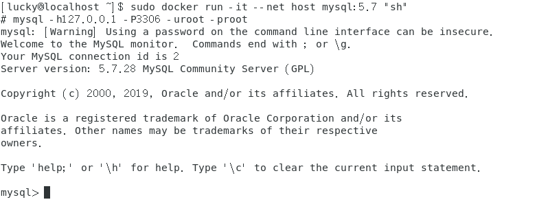   

### 创建`数据卷`并`挂载`  
- 删除名为`mysql2`的的所有`containers`：`sudo docker rm $(docker ps -a -q) -f -v`
- 创建`数据卷`：`sudo docker volume create mydb`

      

- 将其挂载到`/var/lib/mysql`目录下

    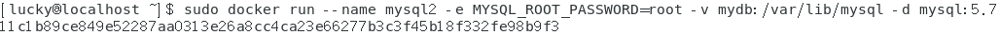  

- 启动客户端容器链接`mysql2`服务器：`sudo docker run --name myclient --link mysql2:mysql -it mysql:5.7 bash`(`--link`连接两个容器)

    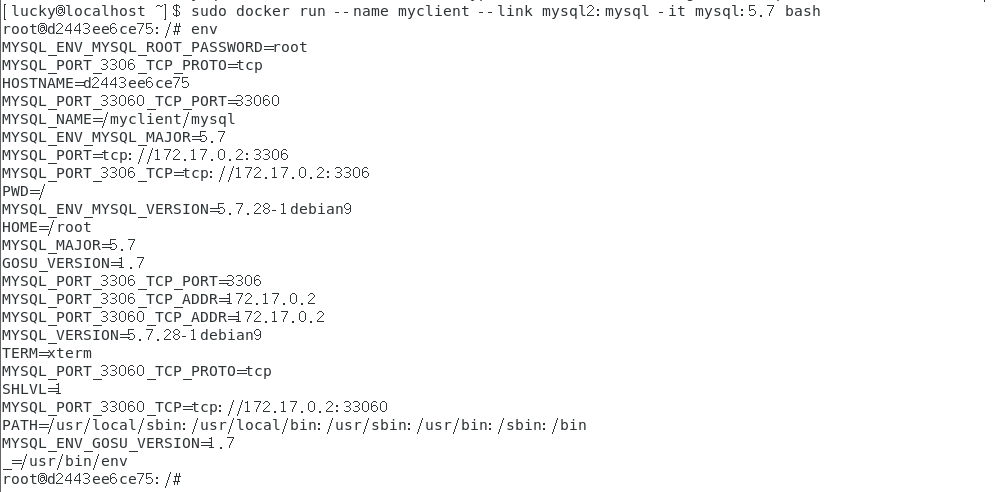  

- 使用别名`mysql`访问服务器：`mysql -hmysql -P3306 -uroot -proot`  

    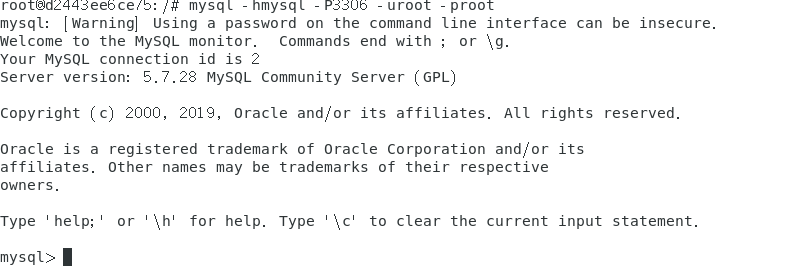  

- 挂载现有数据库：`sudo docker run -v "$PWD/data":/var/lib/mysql --user 1000:1000 --name some-mysql -e MYSQL_ROOT_PASSWORD=my-secret-pw -d mysql:tag`  

- 修改容器配置：`sudo docker run --name some-mysql -v /my/custom:/etc/mysql/conf.d -e MYSQL_ROOT_PASSWORD=my-secret-pw -d mysql:tag`

### `Docker compose` 与多容器应用`自动化部署`  
- 先下载`docker-compose`（类似于`ant`）：`sudo curl -L https://github.com/docker/compose/releases/download/1.21.2/docker-compose-$(uname -s)-$(uname -m) -o /usr/local/bin/docker-compose`   

    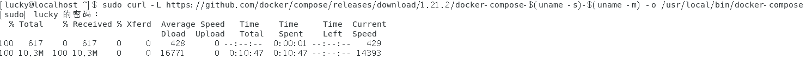  

- 开启执行权限：`sudo chmod +x /usr/local/bin/docker-compose`

- 查看安装结果：`docker-compose -v`  

      

- 再编写`stack.yml`（自动化部署文件，类似ant的`build.xml`）：`mkdir comptest && cd comptest`, `vi stack.yml`  

    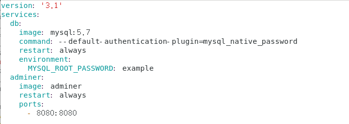

- 启动服务：`sudo docker-compose -f stack.yml up`  

### `docker` 网络
- 容器`默认`使用网络：`Docker0`（桥接）
- 容器支持的网络与类型
   - `bridge` （本机内网络）
   - `host`     （主机网卡） 
   - `overlay` （跨主机网络） 
   - `none`
   - `Custom`（网络插件）

- 管理容器网络：`sudo docker network ls`

      

- 配置支持 `ifconfig` 和 `ping` 命令的 `ubuntu 容器`  
   - 先运行`ubuntu`容器：`sudo docker run --name unet -it --rm ubuntu bash`  
   - 更新容器：`apt-get update`  

        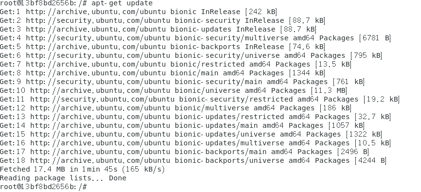    

   - 安装网络工具包`net-tools`：`apt-get install net-tools`  

        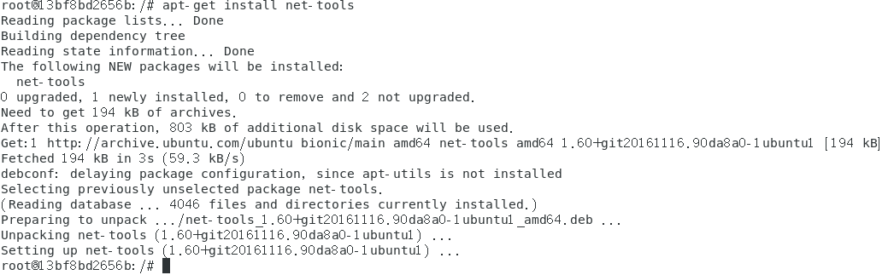  

   - 安装`ping`的依赖包：`apt-get install iputils-ping -y`  

        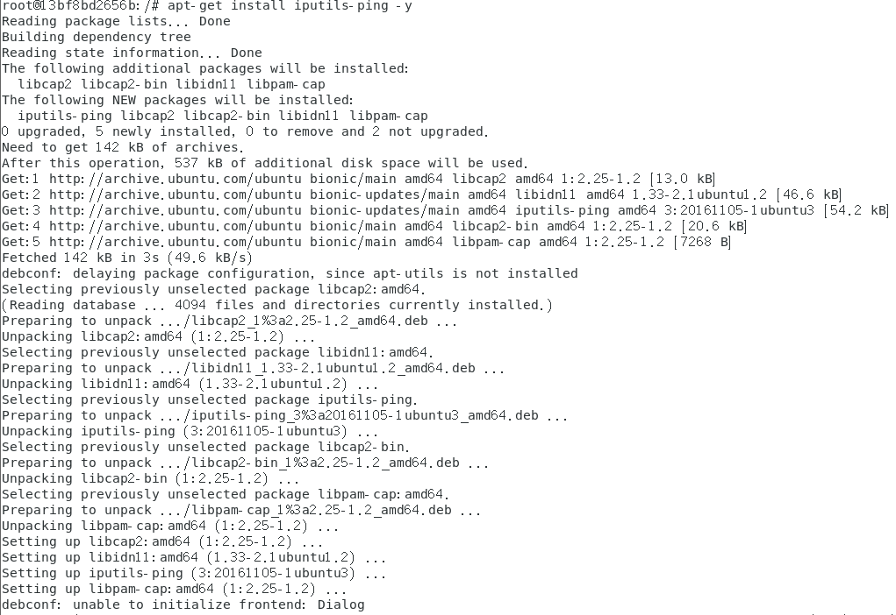

   - `ifconfig`命令
    
        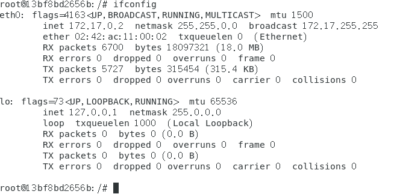  

   - `ping`命令：`ping 127.0.0.1`  

        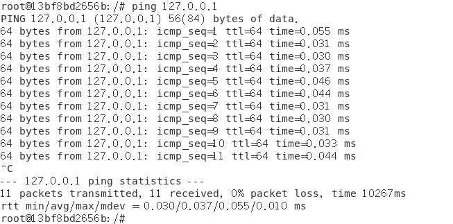

- 启动另一个命令窗口，由容器制作镜像：`sudo docker commit unet ubuntu:net`  

    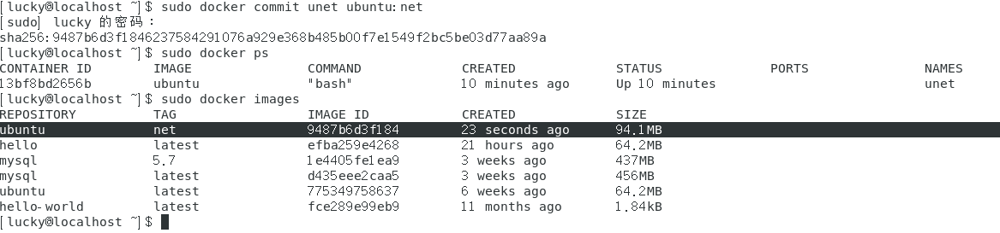

- 创建`自定义网络`：`sudo docker network create mynet`  

    
    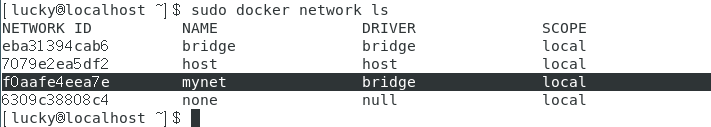  

### `Docker` 仓库
- 搭建`私有`容器仓库  
   - 创建一个`容器仓库`：`sudo docker run -d -p 5000:5000 --restart=always --name registry registry:2`  

        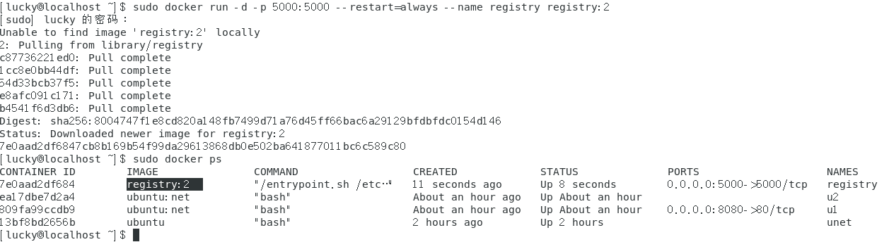  

   - 从`Docker Hub`中复制一个`镜像`到仓库中
      - Pull一个`image`：`sudo docker pull ubuntu:16.04`

            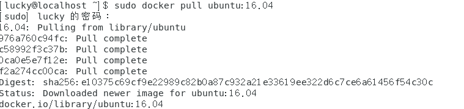

      - 标记该`image`为`localhost:5000/my-ubuntu`：`sudo docker tag ubuntu:16.04 localhost:5000/my-ubuntu`  

      - Push该`image`到本地的仓库中：`sudo docker push localhost:5000/my-ubuntu`
      
              
      
      - 删除`本地缓存`的`ubuntu:16.04` 和 `localhost:5000/my-ubuntu` 镜像，以测试从仓库中`Pull`镜像：`sudo docker image remove ubuntu:16.04`, `sudo docker image remove localhost:5000/my-ubuntu`  

            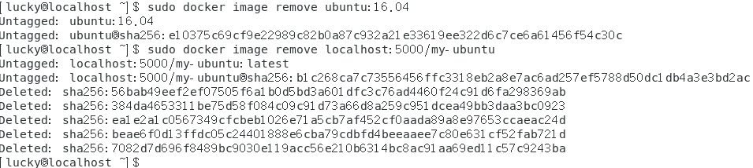  

      - 从仓库中`Pull`镜像：`sudo docker pull localhost:5000/my-ubuntu`  

            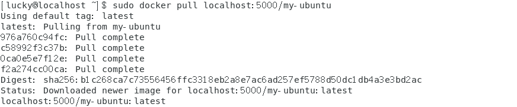  

   - 停止一个`本地仓库`：`sudo docker container stop registry && sudo docker container rm -v registry`

        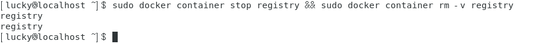  

- 阿里云`容器镜像服务`实践：在访问`https://cr.console.aliyun.com`注册完用户之后，测试上传`hello-world`镜像  
   - 登陆：`sudo docker login --username=<your account> registry.cn-shenzhen.aliyuncs.com`

        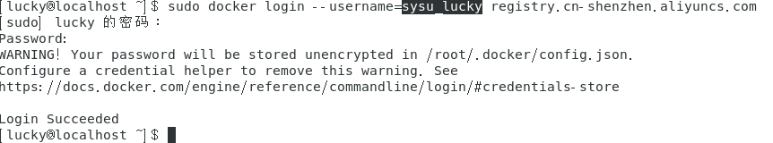  

   - 标签：`sudo docker tag hello-world registry.cn-shenzhen.aliyuncs.com/pmlpml/repo:hello-world`  

   - 上传：`sudo docker push registry.cn-shenzhen.aliyuncs.com/pmlpml/repo:hello-world`

   - 下载：`sudo docker pull registry.cn-shenzhen.aliyuncs.com/pmlpml/repo:hello-world`  

        

   - 标签：`sudo docker tag registry.cn-shenzhen.aliyuncs.com/pmlpml/repo:hello-world hello-world`
   - 删除：`sudo docker rmi registry.cn-shenzhen.aliyuncs.com/pmlpml/repo:hello-world`  

          

   - 运行：`sudo docker run --rm hello-world`  

        

   - 退出：`sudo docker logout registry.cn-shenzhen.aliyuncs.com`  

          


### 容器`监控`与`日志`
- 检查`docker`的状态：`sudo docker info`(`服务版本：docker info --format {{.ServerVersion}}`)

      
      

- 查看容器内进程：`sudo docker top [container name]`

      

- 查看容器进程状态：`sudo docker status`  

      

- 查看容器详细信息：`sudo docker inspect [container name]`

      
    
      
    `......`

### `docker`图形化管理工具
- web图形化管理工具：`Portainer`
- `单节点`运行`Portainer`：`sudo docker run -d -p 9000:9000 -v /var/run/docker.sock:/var/run/docker.sock portainer/portainer`  

      
