# Golang 开发CLI程序Agenda(简单版)

## 安装Golang包cobra  
直接使用指令*go get -v github.com/spf13/cobra/cobra*  
然而会出现以下错误：其中有两个依赖文件下载失败，分别为**golang.org/x/text/transfrom**和**golang.org/x/text/unicode/norm**  
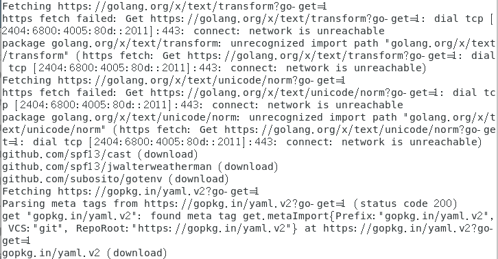  
  
处理办法是进入本地的GO工作空间的src/golang.org/x目录中，直接从github上下载text文件即可  
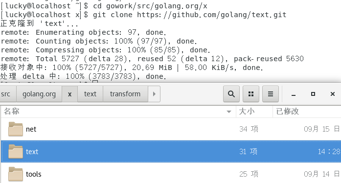  
  
然后用指令**go install github.com/spf13/cobra/cobra**完成cobra的安装  
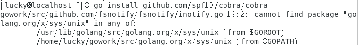  
  
然后发现还有一个依赖包**golang.org/x/sys/unix**未下载成功，同样的去到本地环境中的相应目录，从githu
b上下载  
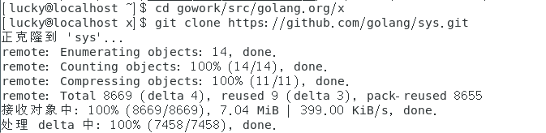  

重新安装cobra就能成功了  
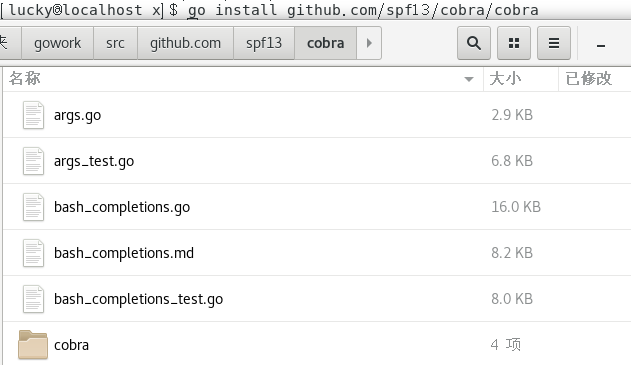  
  
在gowork/src/github.com/user目录下创建一个项目文件夹agenda  
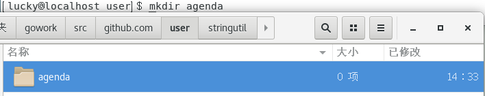  
  
在此文件夹下通过指令**cobra init --pkg-name agenda**初始化一个agenda项目，然后可以通过tree查看此项目的文件树。  
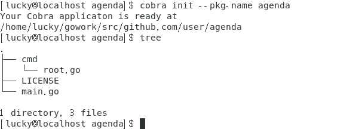  
  
然后可以利用cobra，通过指令**cobra add**在cmd目录下添加需要完成的功能，系统会自动添加一个.go文件，我要实现的命令如下：  
- cobra add register（注册用户）
- cobra add login（用户登陆）
- cobra add logout（用户登出）
- cobra add findUser（查询用户）
- cobra add deleteUser（删除用户）  
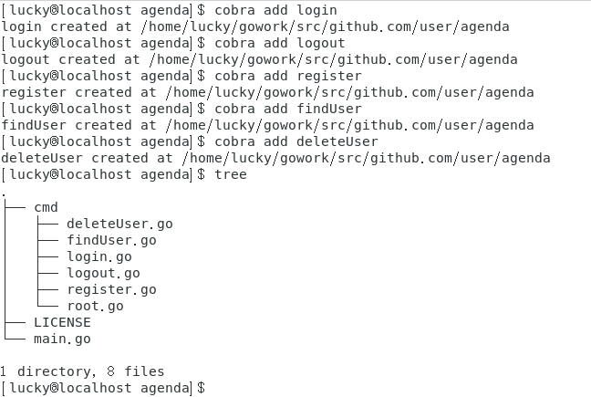  
  
- 最后再添加一些其他需要实现的功能文件，最终文件树如下  
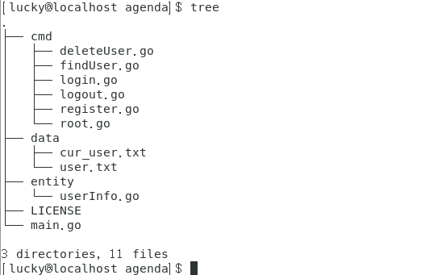  

## Agenda具体实现  
### 功能实现  
- register.go，用于注册用户  
命令：agenda register -u username -p password -e email -n phone  
参数解释：
    - -u：用户名（不可重复）  
    - -p：用户密码（至少6位）  
    - -e：电子邮箱（不可重复）  
    - -n：电话号码（11位数字）  
  
    代码实现：  
    - 首先要用Flags().StringP(...)将flag绑定到控制台的变量上，然后通过Flags().GetString(...)函数获取flag绑定的变量  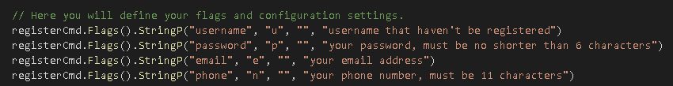  
     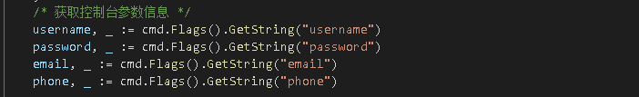  
    - 然后通过调用checkRegister对注册的用户信息进行检测  
        - 因为需要查重，所以要先读取已有的用户信息，此处是通过调用entity/userInfo.go中的ReadUserInfo函数实现的（在后面用户数据处理部分会有详细解释）  
        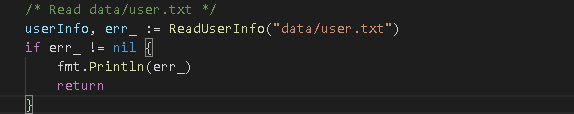  
        - 然后进行用户信息检查，成功则输出相应信息并通过append函数将该User（用户信息的结构体，后面会解释）添加到userInfo（用户信息结构体数组）中，并通过调用entity/userInfo.go中的WriteUserInfo函数将新的userInfo写进user.txt（json格式的用户信息数据库）中，失败则输出失败信息  
        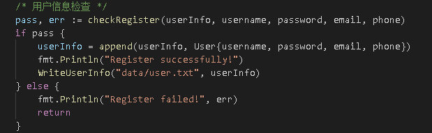  
       
    - 最后是注册用户信息检查函数checkRegister，返回一个bool值，判断信息是否合法；同时返回一个error（通过调用“erros”包中的errors.New函数），保存相应的错误信息
       - 若当前用户/邮箱/电话已存在：显示"Sorry, the username/email/phone already exists, please try again!"  
       - 若密码/邮箱为空：显示"The password/email cannot be empty!"  
       - 若电话号码不为11位：显示"The phone must have eleven digits!"  
       - 若电话号码不全为数字：显示"The phone can only contain digits!"
    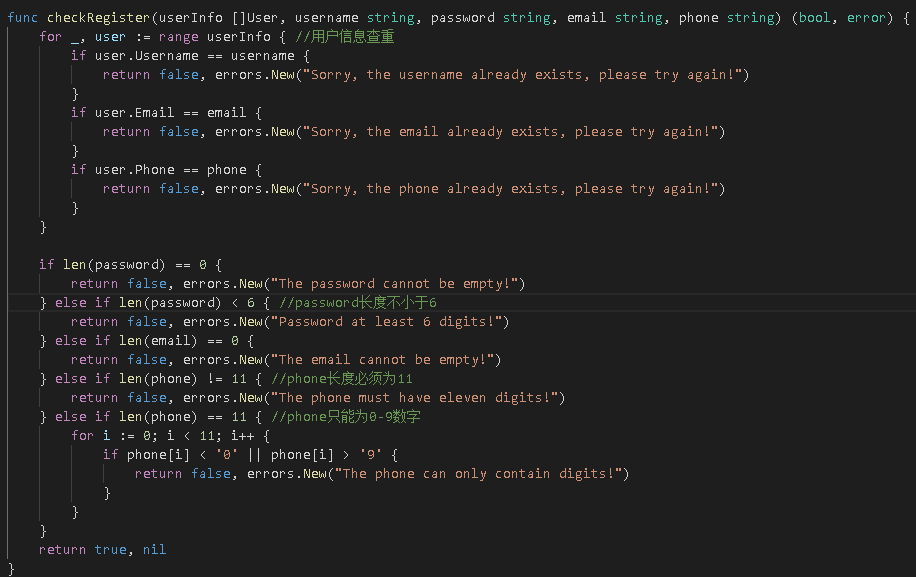   
     
  
- login.go，用于用户登陆  
命令：agenda login -u username -p password   
参数解释：
    - -u：用户名（存在）    
    - -p：用户密码（与用户名匹配）  

    代码实现：  
    - 首先同样要获取控制台的参数信息  
    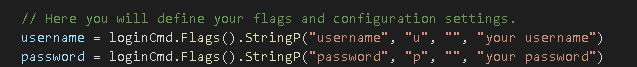  
    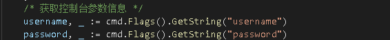  
    - 然后要判断当前是否有用户登陆（因为我在设计时只允许当前有一个用户登陆），判断方式是根据当前用户的数据信息（在data/cur_user.txt中），若当前已经有用户登陆，其中会是"username"，若没有用户登陆，会显示"No user is currently logged in!"  
    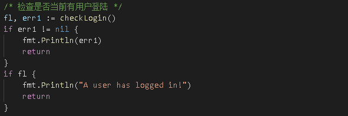  
        - 首先要通过"ioutil"包中的ReadFile函数（函数返回两个值，文件信息和一个error）读取当前用户数据信息（注意将信息转换为string）  
        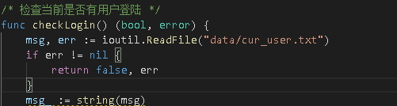  
        - 接着通过该信息判断是否有用户登陆（**注意此处需要判空，当信息为空时也返回false**）  
        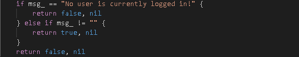  
    - 接着检查用户名和密码是否正确，若正确，输出"Login successfully!"并调用userLogin函数将username信息写入data/cur_user.txt中；若错误，输出想用的错误信息  
        - 若用户名和密码为空：显示"Username and password cannot be empty!"
        - 若用户名不存在：显示"The username does not exist!"  
        - 若密码错误：显示"Wrong password!"  
    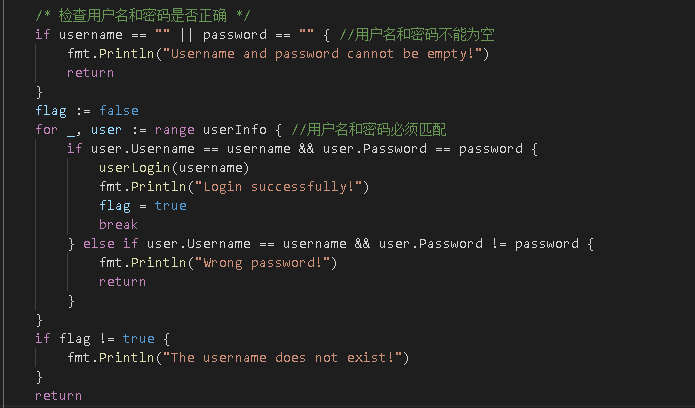  
    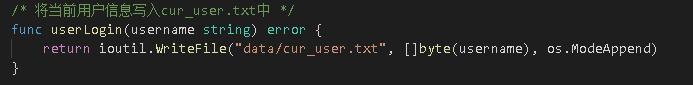  
- logout.go，用于退出当前用户  
命令：agenda logout(只能在登陆状态下使用)  
参数解释：无  
代码实现：直接调用checkLogin函数检查当前是否处于登陆状态，若不是登陆状态，输出登陆提示信息；若是登陆状态，则调用userLogout函数修改当前用户信息（data/cur_user.txt）即可（其中userLogout函数调用了"ioutil"中的WriteFile函数）  
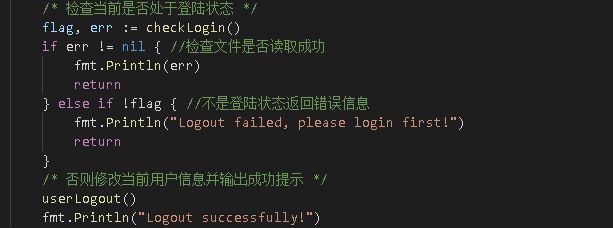  
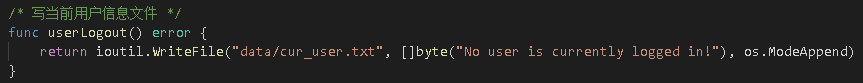  

- findUser.go，用于查询用户数据库信息  
命令：agenda findUser(只能在登陆状态下使用)  
参数解释：无  
代码实现：
   - 首先，同样要检查用户登陆状态，若处于非登陆状态，输出登陆提示信息；若处于登陆状态，继续执行下面操作  
   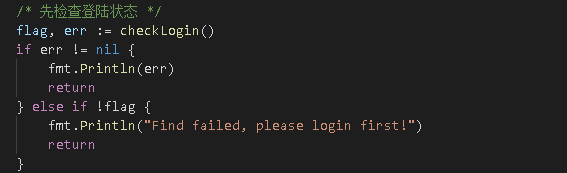    
   - 然后调用ReadUserInfo函数读取用户数据库（data/user.txt）中的信息  
   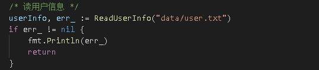  
   - 最后输出用户信息(不包括密码)  
   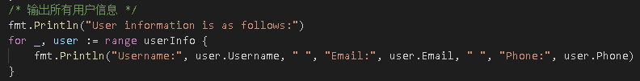  
  
- deleteUser.go，用于删除当前用户  
命令：agenda deleteUser(只能在登陆状态下使用)  
参数解释：无
代码实现：  
   - 首先，依旧要检查登陆状态，若为非登陆，输出提示信息；若为登陆状态，继续执行下面操作  
   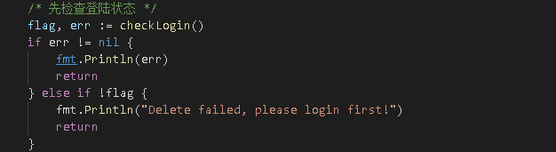  
   - 然后要获取当前用户的用户名，获取方式为读取data/cur_user.txt中的信息  
   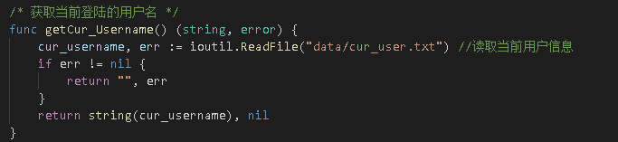  
   - 同时，还要通过调用ReadUserInfo函数读取data/user.txt文件获取所有用户的信息  
   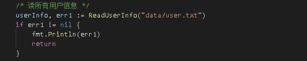  
   - 接着，从用户数据库删除当前用户信息，删除方法为将上面得到的用户数据通过User结构体数组存储，遍历数组，找到与前面获得的当前用户名对应的元素，通过**append(append(userInfo[:i], userInfo[i+1:]...))**的巧妙方法将该元素从结构体数组中删除（当然还可以通过遍历该元素之后的所有元素，将它们全部左移一位，最后把数组长度减一，不过相对比较麻烦）  
   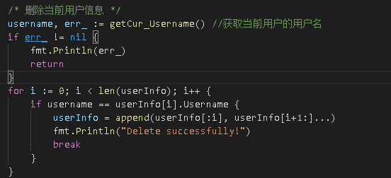  
   - 最后，还需要更新用户数据库的信息，同时还要退出当前用户  
   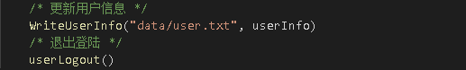  
  
### main.go
main.go调用了**agenda/cmd/root.go**中的Execute()函数，用于启动整个agenda项目（注释掉的部分为用户数据的初始化）  
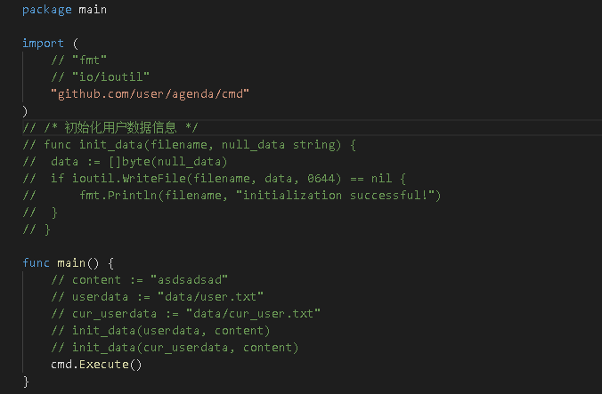  
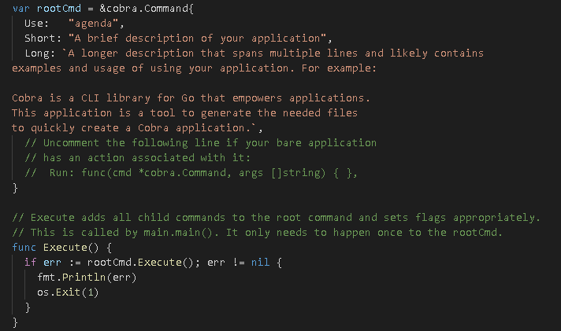  
  
### 用户数据存储  
用户数据存放于data文件夹中，其中user.txt中以json格式存储注册的用户信息，cur_user.txt为当前登陆的用户(初始为空)，若有用户登陆，显示"username"；若当前没有用户登陆，则显示“No user is currently logged in!”  
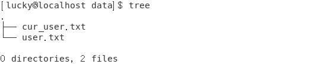  
  
关于对用户数据的操作，在entity文件中的userInfo.go中实现：包括了user的基本信息结构体、从user.txt中读取user以及将user信息写进user.txt中.  
- 用户信息结构体User  
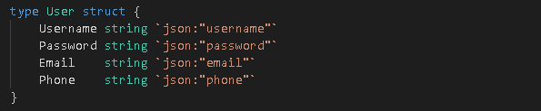  
- 读用户信息函数ReadUserInfo：该函数的传入参数为文件名（string），返回两个值：第一个为结构体数组，第二个为error变量。该函数的功能是将文件中用json格式存储的信息转化为结构体数组形式：首先通过调用"**ioutil**"包中ReadFile函数读取文件中的信息，然后将其转化为字符串，接着通过调用"**json**"包中的Unmarshal函数（该函数有两个参数，第一个参数为json字符串，第二个参数为转化后的结构体数组）识别字符串中的json格式数据并将其转化为结构体。  
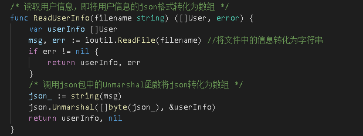  
  
- 写用户信息函数WriteUserInfo：该函数有两个传入参数，第一个为待写的文件名（string），第二个为用户信息的结构体数组（User[]）；返回一个error信息判断是否写成功。该函数的功能是将传入的结构体数组转化为json数据格式（调用"**json**"包中的Marshal函数），然后将数据写入指定文件中（调用"**ioutil**"包中WriteFile函数）。  
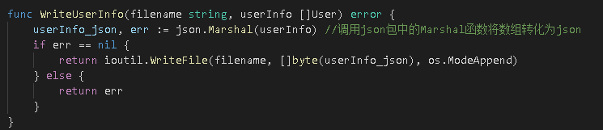  

### 项目测试  
首先通过"**go build**"编译agenda，然后就可以直接通过**agenda [cmd]**运行agenda中的命令了
- 注册用户测试  
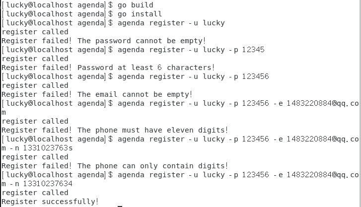  
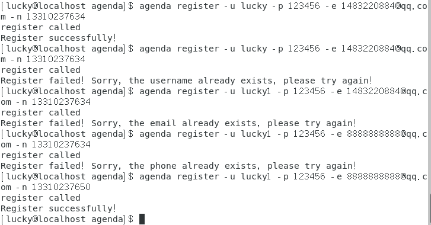  
  
- 用户登陆测试  
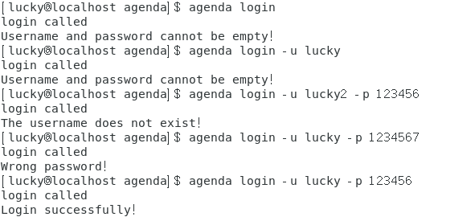  
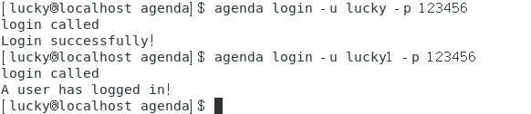  
  
- 用户退出登陆测试  
  
  
- 查询用户信息测试  
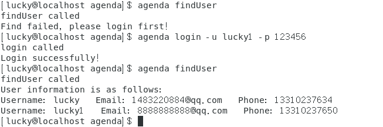  
  
- 删除当前用户测试  
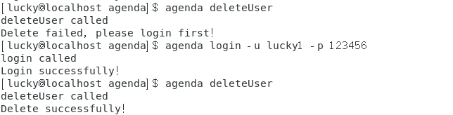  
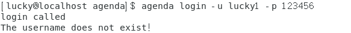  
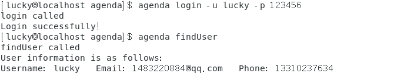  
  
- 用户数据信息文件测试  
   - data/cur_user.txt  
    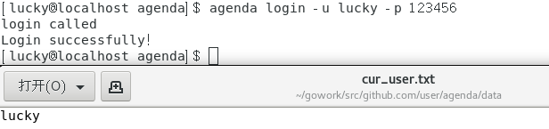  
    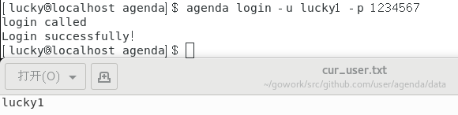  
    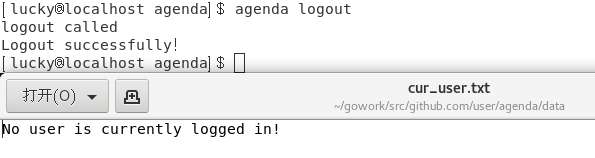  
      
   - data/user.txt  
    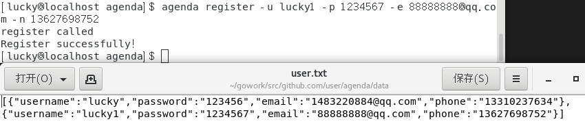  
    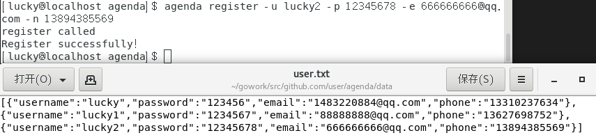  
      
      

### 一些细节  
- "import"时，在包前面加上"."可以省略包的引用，如**import . "fmt"**，在调用时不用"fmt.Println()"而只需"Println()"  
